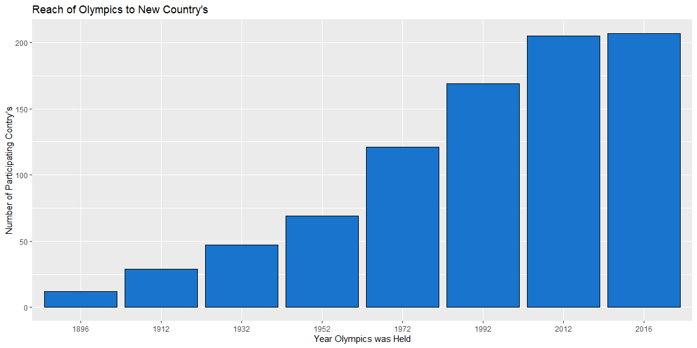
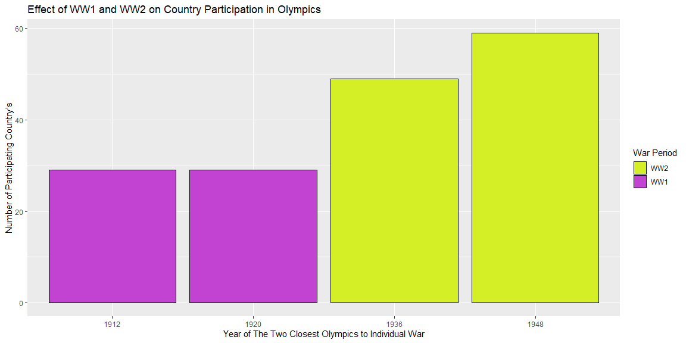

**Week 2 Analysis**


<br />


```r
# Code to get you started. 
# Only the first 100 observations are shown here because the dataset is really too big to show all of it in a markdown file.
datatable(head(Olympics,100), options=list(lengthMenu = c(3,10,30)), extensions="Responsive")
```

```{=html}
<div id="htmlwidget-504e85dadb82e571f287" style="width:100%;height:auto;" class="datatables html-widget"></div>
<script type="application/json" data-for="htmlwidget-504e85dadb82e571f287">{"x":{"filter":"none","extensions":["Responsive"],"data":[["1","2","3","4","5","6","7","8","9","10","11","12","13","14","15","16","17","18","19","20","21","22","23","24","25","26","27","28","29","30","31","32","33","34","35","36","37","38","39","40","41","42","43","44","45","46","47","48","49","50","51","52","53","54","55","56","57","58","59","60","61","62","63","64","65","66","67","68","69","70","71","72","73","74","75","76","77","78","79","80","81","82","83","84","85","86","87","88","89","90","91","92","93","94","95","96","97","98","99","100"],[1,2,3,4,5,5,5,5,5,5,6,6,6,6,6,6,6,6,7,7,7,7,7,7,7,7,8,8,9,10,11,12,13,13,14,15,15,15,15,15,16,17,17,17,17,17,17,17,17,17,17,17,17,17,17,17,17,18,19,20,20,20,20,20,20,20,20,20,20,20,20,20,20,20,20,20,20,20,20,21,22,23,23,24,24,24,25,26,27,28,28,29,30,30,31,32,33,33,34,35],["A Dijiang","A Lamusi","Gunnar Nielsen Aaby","Edgar Lindenau Aabye","Christine Jacoba Aaftink","Christine Jacoba Aaftink","Christine Jacoba Aaftink","Christine Jacoba Aaftink","Christine Jacoba Aaftink","Christine Jacoba Aaftink","Per Knut Aaland","Per Knut Aaland","Per Knut Aaland","Per Knut Aaland","Per Knut Aaland","Per Knut Aaland","Per Knut Aaland","Per Knut Aaland","John Aalberg","John Aalberg","John Aalberg","John Aalberg","John Aalberg","John Aalberg","John Aalberg","John Aalberg","Cornelia \"Cor\" Aalten (-Strannood)","Cornelia \"Cor\" Aalten (-Strannood)","Antti Sami Aalto","Einar Ferdinand \"Einari\" Aalto","Jorma Ilmari Aalto","Jyri Tapani Aalto","Minna Maarit Aalto","Minna Maarit Aalto","Pirjo Hannele Aalto (Mattila-)","Arvo Ossian Aaltonen","Arvo Ossian Aaltonen","Arvo Ossian Aaltonen","Arvo Ossian Aaltonen","Arvo Ossian Aaltonen","Juhamatti Tapio Aaltonen","Paavo Johannes Aaltonen","Paavo Johannes Aaltonen","Paavo Johannes Aaltonen","Paavo Johannes Aaltonen","Paavo Johannes Aaltonen","Paavo Johannes Aaltonen","Paavo Johannes Aaltonen","Paavo Johannes Aaltonen","Paavo Johannes Aaltonen","Paavo Johannes Aaltonen","Paavo Johannes Aaltonen","Paavo Johannes Aaltonen","Paavo Johannes Aaltonen","Paavo Johannes Aaltonen","Paavo Johannes Aaltonen","Paavo Johannes Aaltonen","Timo Antero Aaltonen","Win Valdemar Aaltonen","Kjetil Andr Aamodt","Kjetil Andr Aamodt","Kjetil Andr Aamodt","Kjetil Andr Aamodt","Kjetil Andr Aamodt","Kjetil Andr Aamodt","Kjetil Andr Aamodt","Kjetil Andr Aamodt","Kjetil Andr Aamodt","Kjetil Andr Aamodt","Kjetil Andr Aamodt","Kjetil Andr Aamodt","Kjetil Andr Aamodt","Kjetil Andr Aamodt","Kjetil Andr Aamodt","Kjetil Andr Aamodt","Kjetil Andr Aamodt","Kjetil Andr Aamodt","Kjetil Andr Aamodt","Kjetil Andr Aamodt","Ragnhild Margrethe Aamodt","Andreea Aanei","Fritz Aanes","Fritz Aanes","Nils Egil Aaness","Nils Egil Aaness","Nils Egil Aaness","Alf Lied Aanning","Agnes Erika Aanonsen (-Eyde)","Johan Aantjes","Jan-Erik Aarberg","Jan-Erik Aarberg","Willemien Aardenburg","Pepijn Aardewijn","Pepijn Aardewijn","Evald rma (rman-)","Olav Augunson Aarnes","Mika Lauri Aarnikka","Mika Lauri Aarnikka","Jamale (Djamel-) Aarrass (Ahrass-)","Dagfinn Sverre Aarskog"],["M","M","M","M","F","F","F","F","F","F","M","M","M","M","M","M","M","M","M","M","M","M","M","M","M","M","F","F","M","M","M","M","F","F","F","M","M","M","M","M","M","M","M","M","M","M","M","M","M","M","M","M","M","M","M","M","M","M","M","M","M","M","M","M","M","M","M","M","M","M","M","M","M","M","M","M","M","M","M","F","F","M","M","M","M","M","M","F","M","M","M","F","M","M","M","M","M","M","M","M"],[24,23,24,34,21,21,25,25,27,27,31,31,31,31,33,33,33,33,31,31,31,31,33,33,33,33,18,18,26,26,22,31,30,34,32,22,22,30,30,34,28,28,28,28,28,28,28,28,28,32,32,32,32,32,32,32,32,31,54,20,20,20,20,22,22,22,22,22,26,26,26,26,30,30,30,30,30,34,34,27,22,22,26,24,24,27,24,17,26,43,47,22,26,30,24,23,24,28,30,24],[180,170,null,null,185,185,185,185,185,185,188,188,188,188,188,188,188,188,183,183,183,183,183,183,183,183,168,168,186,null,182,172,159,159,171,null,null,null,null,null,184,175,175,175,175,175,175,175,175,175,175,175,175,175,175,175,175,189,null,176,176,176,176,176,176,176,176,176,176,176,176,176,176,176,176,176,176,176,176,163,170,187,187,null,null,null,null,169,null,170,170,null,189,189,174,null,187,187,187,190],[80,60,null,null,82,82,82,82,82,82,75,75,75,75,75,75,75,75,72,72,72,72,72,72,72,72,null,null,96,null,76.5,70,55.5,55.5,65,null,null,null,null,null,85,64,64,64,64,64,64,64,64,64,64,64,64,64,64,64,64,130,null,85,85,85,85,85,85,85,85,85,85,85,85,85,85,85,85,85,85,85,85,null,125,89,89,null,null,null,null,65,null,77,77,null,72,72,70,null,76,76,76,98],["China","China","Denmark","Denmark/Sweden","Netherlands","Netherlands","Netherlands","Netherlands","Netherlands","Netherlands","United States","United States","United States","United States","United States","United States","United States","United States","United States","United States","United States","United States","United States","United States","United States","United States","Netherlands","Netherlands","Finland","Finland","Finland","Finland","Finland","Finland","Finland","Finland","Finland","Finland","Finland","Finland","Finland","Finland","Finland","Finland","Finland","Finland","Finland","Finland","Finland","Finland","Finland","Finland","Finland","Finland","Finland","Finland","Finland","Finland","Finland","Norway","Norway","Norway","Norway","Norway","Norway","Norway","Norway","Norway","Norway","Norway","Norway","Norway","Norway","Norway","Norway","Norway","Norway","Norway","Norway","Norway","Romania","Norway","Norway","Norway","Norway","Norway","Norway","Norway","Netherlands","Norway","Norway","Netherlands","Netherlands","Netherlands","Estonia","Norway","Finland","Finland","France","Norway"],["CHN","CHN","DEN","DEN","NED","NED","NED","NED","NED","NED","USA","USA","USA","USA","USA","USA","USA","USA","USA","USA","USA","USA","USA","USA","USA","USA","NED","NED","FIN","FIN","FIN","FIN","FIN","FIN","FIN","FIN","FIN","FIN","FIN","FIN","FIN","FIN","FIN","FIN","FIN","FIN","FIN","FIN","FIN","FIN","FIN","FIN","FIN","FIN","FIN","FIN","FIN","FIN","FIN","NOR","NOR","NOR","NOR","NOR","NOR","NOR","NOR","NOR","NOR","NOR","NOR","NOR","NOR","NOR","NOR","NOR","NOR","NOR","NOR","NOR","ROU","NOR","NOR","NOR","NOR","NOR","NOR","NOR","NED","NOR","NOR","NED","NED","NED","EST","NOR","FIN","FIN","FRA","NOR"],["1992 Summer","2012 Summer","1920 Summer","1900 Summer","1988 Winter","1988 Winter","1992 Winter","1992 Winter","1994 Winter","1994 Winter","1992 Winter","1992 Winter","1992 Winter","1992 Winter","1994 Winter","1994 Winter","1994 Winter","1994 Winter","1992 Winter","1992 Winter","1992 Winter","1992 Winter","1994 Winter","1994 Winter","1994 Winter","1994 Winter","1932 Summer","1932 Summer","2002 Winter","1952 Summer","1980 Winter","2000 Summer","1996 Summer","2000 Summer","1994 Winter","1912 Summer","1912 Summer","1920 Summer","1920 Summer","1924 Summer","2014 Winter","1948 Summer","1948 Summer","1948 Summer","1948 Summer","1948 Summer","1948 Summer","1948 Summer","1948 Summer","1952 Summer","1952 Summer","1952 Summer","1952 Summer","1952 Summer","1952 Summer","1952 Summer","1952 Summer","2000 Summer","1948 Summer","1992 Winter","1992 Winter","1992 Winter","1992 Winter","1994 Winter","1994 Winter","1994 Winter","1994 Winter","1994 Winter","1998 Winter","1998 Winter","1998 Winter","1998 Winter","2002 Winter","2002 Winter","2002 Winter","2002 Winter","2002 Winter","2006 Winter","2006 Winter","2008 Summer","2016 Summer","2000 Summer","2004 Summer","1960 Winter","1960 Winter","1964 Winter","1920 Summer","1984 Winter","1984 Summer","1968 Summer","1972 Summer","1988 Summer","1996 Summer","2000 Summer","1936 Summer","1912 Summer","1992 Summer","1996 Summer","2012 Summer","1998 Winter"],[1992,2012,1920,1900,1988,1988,1992,1992,1994,1994,1992,1992,1992,1992,1994,1994,1994,1994,1992,1992,1992,1992,1994,1994,1994,1994,1932,1932,2002,1952,1980,2000,1996,2000,1994,1912,1912,1920,1920,1924,2014,1948,1948,1948,1948,1948,1948,1948,1948,1952,1952,1952,1952,1952,1952,1952,1952,2000,1948,1992,1992,1992,1992,1994,1994,1994,1994,1994,1998,1998,1998,1998,2002,2002,2002,2002,2002,2006,2006,2008,2016,2000,2004,1960,1960,1964,1920,1984,1984,1968,1972,1988,1996,2000,1936,1912,1992,1996,2012,1998],["Summer","Summer","Summer","Summer","Winter","Winter","Winter","Winter","Winter","Winter","Winter","Winter","Winter","Winter","Winter","Winter","Winter","Winter","Winter","Winter","Winter","Winter","Winter","Winter","Winter","Winter","Summer","Summer","Winter","Summer","Winter","Summer","Summer","Summer","Winter","Summer","Summer","Summer","Summer","Summer","Winter","Summer","Summer","Summer","Summer","Summer","Summer","Summer","Summer","Summer","Summer","Summer","Summer","Summer","Summer","Summer","Summer","Summer","Summer","Winter","Winter","Winter","Winter","Winter","Winter","Winter","Winter","Winter","Winter","Winter","Winter","Winter","Winter","Winter","Winter","Winter","Winter","Winter","Winter","Summer","Summer","Summer","Summer","Winter","Winter","Winter","Summer","Winter","Summer","Summer","Summer","Summer","Summer","Summer","Summer","Summer","Summer","Summer","Summer","Winter"],["Barcelona","London","Antwerpen","Paris","Calgary","Calgary","Albertville","Albertville","Lillehammer","Lillehammer","Albertville","Albertville","Albertville","Albertville","Lillehammer","Lillehammer","Lillehammer","Lillehammer","Albertville","Albertville","Albertville","Albertville","Lillehammer","Lillehammer","Lillehammer","Lillehammer","Los Angeles","Los Angeles","Salt Lake City","Helsinki","Lake Placid","Sydney","Atlanta","Sydney","Lillehammer","Stockholm","Stockholm","Antwerpen","Antwerpen","Paris","Sochi","London","London","London","London","London","London","London","London","Helsinki","Helsinki","Helsinki","Helsinki","Helsinki","Helsinki","Helsinki","Helsinki","Sydney","London","Albertville","Albertville","Albertville","Albertville","Lillehammer","Lillehammer","Lillehammer","Lillehammer","Lillehammer","Nagano","Nagano","Nagano","Nagano","Salt Lake City","Salt Lake City","Salt Lake City","Salt Lake City","Salt Lake City","Torino","Torino","Beijing","Rio de Janeiro","Sydney","Athina","Squaw Valley","Squaw Valley","Innsbruck","Antwerpen","Sarajevo","Los Angeles","Mexico City","Munich","Seoul","Atlanta","Sydney","Berlin","Stockholm","Barcelona","Atlanta","London","Nagano"],["Basketball","Judo","Football","Tug-Of-War","Speed Skating","Speed Skating","Speed Skating","Speed Skating","Speed Skating","Speed Skating","Cross Country Skiing","Cross Country Skiing","Cross Country Skiing","Cross Country Skiing","Cross Country Skiing","Cross Country Skiing","Cross Country Skiing","Cross Country Skiing","Cross Country Skiing","Cross Country Skiing","Cross Country Skiing","Cross Country Skiing","Cross Country Skiing","Cross Country Skiing","Cross Country Skiing","Cross Country Skiing","Athletics","Athletics","Ice Hockey","Swimming","Cross Country Skiing","Badminton","Sailing","Sailing","Biathlon","Swimming","Swimming","Swimming","Swimming","Swimming","Ice Hockey","Gymnastics","Gymnastics","Gymnastics","Gymnastics","Gymnastics","Gymnastics","Gymnastics","Gymnastics","Gymnastics","Gymnastics","Gymnastics","Gymnastics","Gymnastics","Gymnastics","Gymnastics","Gymnastics","Athletics","Art Competitions","Alpine Skiing","Alpine Skiing","Alpine Skiing","Alpine Skiing","Alpine Skiing","Alpine Skiing","Alpine Skiing","Alpine Skiing","Alpine Skiing","Alpine Skiing","Alpine Skiing","Alpine Skiing","Alpine Skiing","Alpine Skiing","Alpine Skiing","Alpine Skiing","Alpine Skiing","Alpine Skiing","Alpine Skiing","Alpine Skiing","Handball","Weightlifting","Wrestling","Wrestling","Speed Skating","Speed Skating","Speed Skating","Gymnastics","Luge","Water Polo","Sailing","Sailing","Hockey","Rowing","Rowing","Athletics","Athletics","Sailing","Sailing","Athletics","Bobsleigh"],["Basketball Men's Basketball","Judo Men's Extra-Lightweight","Football Men's Football","Tug-Of-War Men's Tug-Of-War","Speed Skating Women's 500 metres","Speed Skating Women's 1,000 metres","Speed Skating Women's 500 metres","Speed Skating Women's 1,000 metres","Speed Skating Women's 500 metres","Speed Skating Women's 1,000 metres","Cross Country Skiing Men's 10 kilometres","Cross Country Skiing Men's 50 kilometres","Cross Country Skiing Men's 10/15 kilometres Pursuit","Cross Country Skiing Men's 4 x 10 kilometres Relay","Cross Country Skiing Men's 10 kilometres","Cross Country Skiing Men's 30 kilometres","Cross Country Skiing Men's 10/15 kilometres Pursuit","Cross Country Skiing Men's 4 x 10 kilometres Relay","Cross Country Skiing Men's 10 kilometres","Cross Country Skiing Men's 50 kilometres","Cross Country Skiing Men's 10/15 kilometres Pursuit","Cross Country Skiing Men's 4 x 10 kilometres Relay","Cross Country Skiing Men's 10 kilometres","Cross Country Skiing Men's 30 kilometres","Cross Country Skiing Men's 10/15 kilometres Pursuit","Cross Country Skiing Men's 4 x 10 kilometres Relay","Athletics Women's 100 metres","Athletics Women's 4 x 100 metres Relay","Ice Hockey Men's Ice Hockey","Swimming Men's 400 metres Freestyle","Cross Country Skiing Men's 30 kilometres","Badminton Men's Singles","Sailing Women's Windsurfer","Sailing Women's Windsurfer","Biathlon Women's 7.5 kilometres Sprint","Swimming Men's 200 metres Breaststroke","Swimming Men's 400 metres Breaststroke","Swimming Men's 200 metres Breaststroke","Swimming Men's 400 metres Breaststroke","Swimming Men's 200 metres Breaststroke","Ice Hockey Men's Ice Hockey","Gymnastics Men's Individual All-Around","Gymnastics Men's Team All-Around","Gymnastics Men's Floor Exercise","Gymnastics Men's Horse Vault","Gymnastics Men's Parallel Bars","Gymnastics Men's Horizontal Bar","Gymnastics Men's Rings","Gymnastics Men's Pommelled Horse","Gymnastics Men's Individual All-Around","Gymnastics Men's Team All-Around","Gymnastics Men's Floor Exercise","Gymnastics Men's Horse Vault","Gymnastics Men's Parallel Bars","Gymnastics Men's Horizontal Bar","Gymnastics Men's Rings","Gymnastics Men's Pommelled Horse","Athletics Men's Shot Put","Art Competitions Mixed Sculpturing, Unknown Event","Alpine Skiing Men's Downhill","Alpine Skiing Men's Super G","Alpine Skiing Men's Giant Slalom","Alpine Skiing Men's Slalom","Alpine Skiing Men's Downhill","Alpine Skiing Men's Super G","Alpine Skiing Men's Giant Slalom","Alpine Skiing Men's Slalom","Alpine Skiing Men's Combined","Alpine Skiing Men's Downhill","Alpine Skiing Men's Super G","Alpine Skiing Men's Giant Slalom","Alpine Skiing Men's Combined","Alpine Skiing Men's Downhill","Alpine Skiing Men's Super G","Alpine Skiing Men's Giant Slalom","Alpine Skiing Men's Slalom","Alpine Skiing Men's Combined","Alpine Skiing Men's Downhill","Alpine Skiing Men's Super G","Handball Women's Handball","Weightlifting Women's Super-Heavyweight","Wrestling Men's Light-Heavyweight, Greco-Roman","Wrestling Men's Light-Heavyweight, Greco-Roman","Speed Skating Men's 500 metres","Speed Skating Men's 1,500 metres","Speed Skating Men's 1,500 metres","Gymnastics Men's Team All-Around, Free System","Luge Women's Singles","Water Polo Men's Water Polo","Sailing Mixed Three Person Keelboat","Sailing Mixed Three Person Keelboat","Hockey Women's Hockey","Rowing Men's Lightweight Double Sculls","Rowing Men's Lightweight Double Sculls","Athletics Men's Pole Vault","Athletics Men's High Jump","Sailing Men's Two Person Dinghy","Sailing Men's Two Person Dinghy","Athletics Men's 1,500 metres","Bobsleigh Men's Four"],[null,null,null,"Gold",null,null,null,null,null,null,null,null,null,null,null,null,null,null,null,null,null,null,null,null,null,null,null,null,null,null,null,null,null,null,null,null,null,"Bronze","Bronze",null,"Bronze","Bronze","Gold",null,"Gold",null,null,null,"Gold",null,"Bronze",null,null,null,null,null,null,null,null,null,"Gold","Bronze",null,"Silver","Bronze",null,null,"Silver",null,null,null,null,null,"Gold",null,null,"Gold",null,"Gold","Gold",null,null,null,null,null,null,"Silver",null,null,null,null,"Bronze","Silver",null,null,null,null,null,null,null]],"container":"<table class=\"display\">\n  <thead>\n    <tr>\n      <th> <\/th>\n      <th>ID<\/th>\n      <th>Name<\/th>\n      <th>Sex<\/th>\n      <th>Age<\/th>\n      <th>Height<\/th>\n      <th>Weight<\/th>\n      <th>Team<\/th>\n      <th>NOC<\/th>\n      <th>Games<\/th>\n      <th>Year<\/th>\n      <th>Season<\/th>\n      <th>City<\/th>\n      <th>Sport<\/th>\n      <th>Event<\/th>\n      <th>Medal<\/th>\n    <\/tr>\n  <\/thead>\n<\/table>","options":{"lengthMenu":[3,10,30],"columnDefs":[{"className":"dt-right","targets":[1,4,5,6,10]},{"orderable":false,"targets":0}],"order":[],"autoWidth":false,"orderClasses":false,"responsive":true}},"evals":[],"jsHooks":[]}</script>
```

## Background {.tabset .tabset-fade .tabset-pills}


```r
Ol2<-Olympics%>%
  filter(Season=="Summer")%>%
  select(Games,Year,Season,Team,Sport,NOC,Name,ID)
Part2<-Ol2%>%
   filter(Year==1896|Year==1912|Year==1932|Year==1952|Year==1972|Year==1992|Year==2012|Year==2016)%>%
   group_by(Year,NOC)%>%
   summarise(n())
Participants<-Ol2%>%
   group_by(Year,NOC)%>%
   summarise(n())
Part3<-Ol2%>%
  filter(Year==1912|Year==1920|Year==1936|Year==1948)%>%
  group_by(Year,NOC)%>%
  summarise(n())
PartTable<-Part2%>%
  group_by(Year)%>%
  summarise("Number of Participating Country's"=n())
PartTable2<-Part3%>%
  group_by(Year)%>%
  summarise("Number of Participating Country's"=n())
```


What has been the general increase of participating country's in the olympics over time? In addition to did the two major wars, of the 19th century, have an effect on country participation?

### Growth of Olympic Participants Graph


```r
ggplot(Part2,aes(x=factor(Year)))+geom_bar(fill="dodgerblue3",color="black",)+labs(x="Year Olympics was Held",y="Number of Participating Contry's",title="Reach of Olympics to New Country's")
```

<!-- -->

### Major Event Effects Graph


```r
ggplot(Part3,aes(x=factor(Year), fill=ifelse(Year < 1930, "Before", "After")))+geom_bar(color="black")+labs(x="Year of The Two Closest Olympics to Individual War",y="Number of Participating Country's",title="Effect of WW1 and WW2 on Country Participation in Olympics")+ scale_fill_manual(values=c("#d4ef26", "#c242d1", "#d4ef26"),name="War Period",labels=c("WW2", "WW1"))
```

<!-- -->


### Graph Data Explaination

**Growth of Olympic Participants Graph Data**

```r
pander(PartTable)
```


--------------------------------
 Year   Number of Participating 
               Country's        
------ -------------------------
 1896             12            

 1912             29            

 1932             47            

 1952             69            

 1972             121           

 1992             169           

 2012             205           

 2016             207           
--------------------------------

**Major Event Effects Graph Data**

```r
pander(PartTable2)
```


--------------------------------
 Year   Number of Participating 
               Country's        
------ -------------------------
 1912             29            

 1920             29            

 1936             49            

 1948             59            
--------------------------------


##
To answer my first question I created a bar graph that shows the increase of country's participating each year at an interval of 20 years per measurement. It can be plainly seen that over time participation has grown at an almost eponetial rate until the last couple of years due to nerarly every country in the world being a participant in the 2016 Olympics. The largest increase in between Olympiccs as described by the graph is between 1952 and 1972 this may be due to the distnance in date from World War 2 each of those years having and the capability of newer country's being able to particpate in 1972.

Additionally I compared the differnece in participation of country's between the olympics that fall directly beofre and after both World War 1 and World War 2. It is interesting to see no difference in participating country's between 1912 and 1920 for WW1. While there was a moderate differnece between 1936 and 1948 for WW2. 

Overall it was interesting to learn how many new country's for the longest time would begin to participate in the Olympics. It truely shows that there is great companionship to be had in sport competition as everyone semms to want to participate.<!-- or comment it out -->


[^1]: Note that Stephanie is a fictional character who is based on real experiences of many faculty and staff here at BYU-Idaho.
