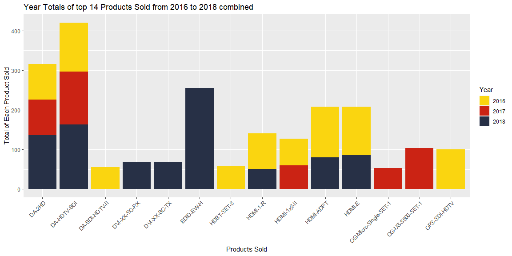
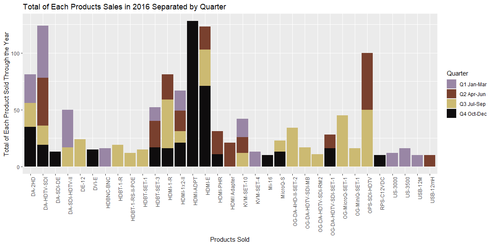
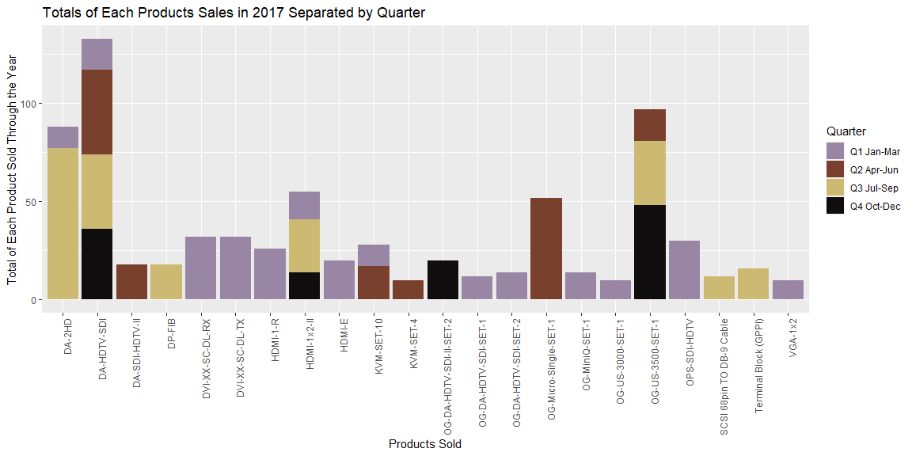
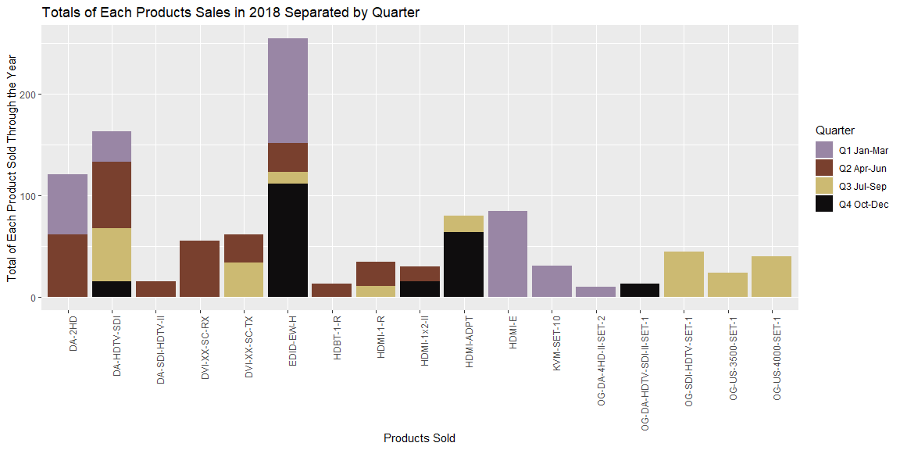

William, based on the follow-up question, asking the quantity of each product sold over a year and in each quarter, with regards to your product sales over the years I put together a couple of graphs to better explain the Data you provided me.


## Your Outcomes {.tabset .tabset-fade .tabset-pills}

### Overall Product Sales 2016-2018

For this first graph I took all of your sales over the past 3 years and combined the numbers to get overall totals for the top 14 products you sold in the 3 years. As you can see each column on the graph represents an overall total with a combination from the sales of all three years. 

```r
ggplot(SalesData6,aes(x=factor(Item),y=Quantity,fill=factor(Year)))+
  geom_col()+
  scale_fill_manual(name="Year",
                    values = wes_palette("BottleRocket2"))+
  labs(x="Products Sold",
       y="Total of Each Product Sold",
       title="Year Totals of top 14 Products Sold from 2016 to 2018 combined")+
  theme(axis.text.x = element_text(angle = 45,hjust = 1))
```

<!-- -->
 
Additioinally, I provided two tables one with the overall totals and the other broken down into by year. the most interesting statistic I found fom this graph was that only two products were sold in all 3 years and they also happen to be the first and second most sold product.

```r
pander(SalesData7)
```


----------------------------------
         Item            Quantity 
----------------------- ----------
        DA-2HD             316    

      DA-HDTV-SDI          420    

    DA-SDI-HDTV-II          55    

     DVI-XX-SC-RX           68    

     DVI-XX-SC-TX           68    

       EDID-EW-H           255    

      HDBT-SET-3            58    

       HDMI-1-R            140    

      HDMI-1x2-II          127    

       HDMI-ADPT           208    

        HDMI-E             208    

 OG-Micro-Single-SET-1      53    

   OG-US-3500-SET-1        104    

     OPS-SDI-HDTV          100    
----------------------------------


```r
pander(SalesData6)
```


-----------------------------------------
 Year           Item            Quantity 
------ ----------------------- ----------
 2016          DA-2HD              90    

 2016        DA-HDTV-SDI          124    

 2016      DA-SDI-HDTV-II          55    

 2016        HDBT-SET-3            58    

 2016         HDMI-1-R             89    

 2016        HDMI-1x2-II           67    

 2016         HDMI-ADPT           128    

 2016          HDMI-E             123    

 2016       OPS-SDI-HDTV          100    

 2017          DA-2HD              90    

 2017        DA-HDTV-SDI          133    

 2017        HDMI-1x2-II           60    

 2017   OG-Micro-Single-SET-1      53    

 2017     OG-US-3500-SET-1        104    

 2018          DA-2HD             136    

 2018        DA-HDTV-SDI          163    

 2018       DVI-XX-SC-RX           68    

 2018       DVI-XX-SC-TX           68    

 2018         EDID-EW-H           255    

 2018         HDMI-1-R             51    

 2018         HDMI-ADPT            80    

 2018          HDMI-E              85    
-----------------------------------------

#### Summary of Graph

Based ont he data you provided the highest selling procudt in a single year was The EDID-EW-H in 2018 with 255 units sold. While the EDID-EW-H  was the most sold product in 2018 it was not sold at all in 2017 and 2016. 

The overall top two Products sold over the Three years were the DA-HDTV-SDI and DA-2HD with 420 and 316 units sold respectively. Overall there could be a trend with products that sell consistently from year to year and their popularity in sales.

### 2016 Product Sales Info

For this graph and the other two prceding grpahs all the products represented on the graph had greater than 10 sales in a single quarter. While I was not able to account for the return of products for this graph and the next two graphs with regards to 2017 sales ifo and 2018 sales info.


```r
ggplot(SalesData2016fl,aes(x=factor(Item),y=Quantity,fill=factor(Quarter)))+
  geom_col()+
  scale_fill_manual(name="Quarter",
                    labels=c("Q1 Jan-Mar","Q2 Apr-Jun","Q3 Jul-Sep","Q4 Oct-Dec"),
                    values = wes_palette("IsleofDogs1"))+
  labs(x="Products Sold",
       y="Total of Each Product Sold Through the Year",
       title="Total of Each Products Sales in 2016 Separated by Quarter")+
theme(axis.text.x = element_text(angle = 90,hjust = 1))
```

<!-- -->

This is the data split between each Item and Quarter that was used for this graph.

```r
pander(SalesData2016fl)
```


--------------------------------------------------
 Year   Quarter           Item           Quantity 
------ --------- ---------------------- ----------
 2016     Q1             DA-2HD             25    

 2016     Q1          DA-HDTV-SDI           46    

 2016     Q1         DA-SDI-HDTV-II         33    

 2016     Q1           HDBNC-BNC            16    

 2016     Q1           HDBT-SET-3           12    

 2016     Q1          HDMI-1x2-II           18    

 2016     Q1           KVM-SET-10           16    

 2016     Q1           KVM-SET-4            13    

 2016     Q1            US-3000             12    

 2016     Q1            US-3500             16    

 2016     Q1            USB-12M             10    

 2016     Q2          DA-HDTV-SDI           42    

 2016     Q2           HDBT-SET-3           23    

 2016     Q2            HDMI-1-R            22    

 2016     Q2          HDMI-1x2-II           18    

 2016     Q2             HDMI-E             20    

 2016     Q2            HDMI-PHR            20    

 2016     Q2          HDMI Adapter          21    

 2016     Q2           KVM-SET-10           14    

 2016     Q2      OG-DA-HDTV-SDI-SET-1      12    

 2016     Q2          OPS-SDI-HDTV          50    

 2016     Q2            USB-12mH            10    

 2016     Q3             DA-2HD             21    

 2016     Q3          DA-HDTV-SDI           17    

 2016     Q3         DA-SDI-HDTV-II         17    

 2016     Q3             DE-12              24    

 2016     Q3            HDBT-1-R            19    

 2016     Q3        HDBT-1-RS-II-POE        12    

 2016     Q3           HDBT-SET-1           15    

 2016     Q3            HDMI-1-R            43    

 2016     Q3          HDMI-1x2-II           10    

 2016     Q3             HDMI-E             32    

 2016     Q3           KVM-SET-10           12    

 2016     Q3            MicroQ-S            10    

 2016     Q3       OG-DA-4HD-II-SET-2       34    

 2016     Q3       OG-DA-HDTV-SDI-MB        17    

 2016     Q3       OG-DA-HDTV-SDI-RM2       11    

 2016     Q3        OG-MicroQ-SET-1         45    

 2016     Q3         OG-MiniQ-SET-1         16    

 2016     Q3          OPS-SDI-HDTV          50    

 2016     Q4             DA-2HD             35    

 2016     Q4          DA-HDTV-SDI           19    

 2016     Q4           DA-SDI-DE            13    

 2016     Q4             DVI-E              15    

 2016     Q4           HDBT-SET-3           17    

 2016     Q4            HDMI-1-R            16    

 2016     Q4          HDMI-1x2-II           21    

 2016     Q4           HDMI-ADPT           128    

 2016     Q4             HDMI-E             71    

 2016     Q4            HDMI-PHR            11    

 2016     Q4             Mi-16              10    

 2016     Q4            MicroQ-S            13    

 2016     Q4      OG-DA-HDTV-SDI-SET-1      16    

 2016     Q4           RPS-C12VDC           10    
--------------------------------------------------

#### Summary of Graph

Out of the data you had fom 2016 there were four products that sold 100 units and greater. The products were DA-HDTV-SDI, HDMI-ADPT, HDMI-E, and OPS-SDI-HDTV each having 124,128,123,100 units sold respectively. The interesting situation here was that the Product HDMI-ADPT had a large single order at the end of the year which was greater than all the other product sales totals throughout the year.

### 2017 Product Sales Info


```r
ggplot(SalesData2017fl,aes(x=factor(Item),y=Quantity,fill=factor(Quarter)))+
  geom_col()+
  scale_fill_manual(name="Quarter",
                    labels=c("Q1 Jan-Mar","Q2 Apr-Jun","Q3 Jul-Sep","Q4 Oct-Dec"),
                    values = wes_palette("IsleofDogs1"))+
  labs(x="Products Sold",
       y="Total of Each Product Sold Through the Year",
       title="Totals of Each Products Sales in 2017 Separated by Quarter")+
theme(axis.text.x = element_text(angle = 90,hjust = 1))
```

<!-- -->

This is the data split between each Item and Quarter that was used for this graph.

```r
pander(SalesData2017fl)
```


------------------------------------------------------
 Year   Quarter             Item             Quantity 
------ --------- -------------------------- ----------
 2017     Q1               DA-2HD               11    

 2017     Q1            DA-HDTV-SDI             16    

 2017     Q1          DVI-XX-SC-DL-RX           32    

 2017     Q1          DVI-XX-SC-DL-TX           32    

 2017     Q1              HDMI-1-R              26    

 2017     Q1            HDMI-1x2-II             14    

 2017     Q1               HDMI-E               20    

 2017     Q1             KVM-SET-10             11    

 2017     Q1        OG-DA-HDTV-SDI-SET-1        12    

 2017     Q1        OG-DA-HDTV-SDI-SET-2        14    

 2017     Q1           OG-MiniQ-SET-1           14    

 2017     Q1          OG-US-3000-SET-1          10    

 2017     Q1            OPS-SDI-HDTV            30    

 2017     Q1              VGA-1x2               10    

 2017     Q2            DA-HDTV-SDI             43    

 2017     Q2           DA-SDI-HDTV-II           18    

 2017     Q2             KVM-SET-10             17    

 2017     Q2             KVM-SET-4              10    

 2017     Q2       OG-Micro-Single-SET-1        52    

 2017     Q2          OG-US-3500-SET-1          16    

 2017     Q3               DA-2HD               77    

 2017     Q3            DA-HDTV-SDI             38    

 2017     Q3               DP-FIB               18    

 2017     Q3            HDMI-1x2-II             27    

 2017     Q3          OG-US-3500-SET-1          33    

 2017     Q3      SCSI 68pin TO DB-9 Cable      12    

 2017     Q3       Terminal Block (GPPI)        16    

 2017     Q4            DA-HDTV-SDI             36    

 2017     Q4            HDMI-1x2-II             14    

 2017     Q4      OG-DA-HDTV-SDI-II-SET-2       20    

 2017     Q4          OG-US-3500-SET-1          48    
------------------------------------------------------

#### Summary of Graph

2017 compared to 2016 was slower n the amount units total units sold throughout the year for each product. Only one Product sold more than 100 units and it was the DA-HDTV-SDI. Additionally the DA-HDTV-SDI product sold in all four quarters of the year.

### 2018 Product Sales Info


```r
ggplot(SalesData2018fl,aes(x=factor(Item),y=Quantity,fill=factor(Quarter)))+
  geom_col()+
  scale_fill_manual(name="Quarter",
                    labels=c("Q1 Jan-Mar","Q2 Apr-Jun","Q3 Jul-Sep","Q4 Oct-Dec"),
                    values = wes_palette("IsleofDogs1"))+
  labs(x="Products Sold",
       y="Total of Each Product Sold Through the Year",
       title="Totals of Each Products Sales in 2018 Separated by Quarter")+
theme(axis.text.x = element_text(angle = 90,hjust = 1))
```

<!-- -->
This is the data split between each Item and Quarter that was used for this graph

```r
pander(SalesData2018fl)
```


-----------------------------------------------------
 Year   Quarter            Item             Quantity 
------ --------- ------------------------- ----------
 2018     Q1              DA-2HD               59    

 2018     Q1            DA-HDTV-SDI            30    

 2018     Q1             EDID-EW-H            103    

 2018     Q1              HDMI-E               85    

 2018     Q1            KVM-SET-10             31    

 2018     Q1        OG-DA-4HD-II-SET-2         10    

 2018     Q2              DA-2HD               62    

 2018     Q2            DA-HDTV-SDI            65    

 2018     Q2          DA-SDI-HDTV-II           16    

 2018     Q2           DVI-XX-SC-RX            56    

 2018     Q2           DVI-XX-SC-TX            28    

 2018     Q2             EDID-EW-H             29    

 2018     Q2             HDBT-1-R              13    

 2018     Q2             HDMI-1-R              24    

 2018     Q2            HDMI-1x2-II            14    

 2018     Q3            DA-HDTV-SDI            52    

 2018     Q3           DVI-XX-SC-TX            34    

 2018     Q3             EDID-EW-H             11    

 2018     Q3             HDMI-1-R              11    

 2018     Q3             HDMI-ADPT             16    

 2018     Q3         OG-SDI-HDTV-SET-1         45    

 2018     Q3         OG-US-3500-SET-1          24    

 2018     Q3         OG-US-4000-SET-1          40    

 2018     Q4            DA-HDTV-SDI            16    

 2018     Q4             EDID-EW-H            112    

 2018     Q4            HDMI-1x2-II            16    

 2018     Q4             HDMI-ADPT             64    

 2018     Q4      OG-DA-HDTV-SDI-II-SET-1      13    
-----------------------------------------------------

#### Summary of graph

Based on the graph ther a couple of products that sold over 100 units in 2018 as copared to 2017. For instance, the three products that sold over 100 units were the DA-2HD = 136 units, DA-HDTV-SDI = 163 units, and the EDID-EW-H = 255 units. This was interesting to see the jump in sales towards the end of the year but could also be linked to customers wanting to fully spend ther budgets by the end of the year. Additionally, the product EDID-EW-H which was the most sold product out of all the years also had high sales, over 100 units, in both the first and fourth quarter of the year.


## Conclusion

Based on the graphs I hope that you will b able to understand your sales numbers more thourhgly I would suggest looking into what actions you took to get those sales specifically the EDID-EW-H productit seeems as thought there is much potential there for possible future sales. Additionally, the products DA-2HD and DA-HDTV-SDI are great candidates for some better looking into for their sales as the have the highest sales overall and are consistently sold each year.
<!--  top 14 items over the three years.  
-->


