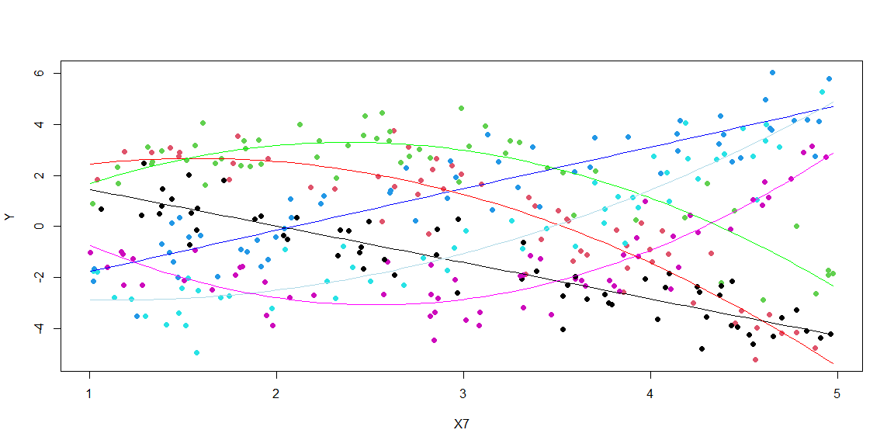

## Creating your Data

Remember the rules...

### Rules

1. Your csv must contain 11 columns of data.
    * The first column must be your (1) Y-variable (labeled as "Y").
    * The other ten columns must be (10) X-variables (labeled as "X1", "X2", ... , "X10").
    
2. Your Y-variable (or some transformation of the Y-variable) must have been created from a linear regression model using only X-variables (or transformations of those X-variables) from within your data set.
    * Be very careful with transformations. You must ensure that you do not break the rules of a linear regression if you choose to use transformations.
    * If you choose transformations, only these functions are allowed when transforming X and Y variables: 1/Y^2, 1/Y, log(Y), sqrt(Y), Y^2, Y^3, 1/X^2, 1/X, log(X), sqrt(X), X^2, X^3, X^4, X^5. Don't forget to check Rule #3 carefully if you choose transformations.
    
3. Your sample size must be sufficiently large so that when the true model is fit to your data using lm(...), all p-values of X-variable terms (not including the intercept) found in the summary(...) are significant.


### True Model

Write out your final "true" model in mathematical form. Make sure it matches your code.

$$
   Y_i = \beta_0 + \beta_1 X_{7i} + \beta_2 X_{4i} + \beta_3 X_{4i} X_{7i} + \beta_4 X_{4i}+\beta_5 X_{7i} X_{4i} +\beta_6 X_{7i}^2 X_{4i} +\beta_7 X_{4i}+(\beta_8 + \beta_9 X_{7i} +\beta_{10} X_{4i} +\beta_{11} X_{7i} X_{4i}+\beta_{12} X_{7i}^2 X_{4i}+\beta_{13} X_{4i}+\beta_{14} X_{7i} X_{4i}+\beta_{15} X_{7i}^2 X_{4i})*X_{1i}+\epsilon_i
$$

### The Code to Make the Data


```r
set.seed(122) 
 n <- 345
 #348 351 345  337
 X1 <- sample(c(1,0), n, replace=TRUE) #replace this
 X2 <- sample(c(1,2,3), n, replace=TRUE) #replace this
 X3 <- runif(n,1,5) #replace this
 X4 <- sample(c("a","b","c"), n, replace=TRUE) #replace this
 X5 <- rnorm(n, 3, 1) #replace this
 X6 <- rchisq(n, 20) #replace this
 X7 <- runif(n, 1, 5) #replace this
 X8 <- rt(n, 50) #replace this
 X9 <- sample(c("a","b","c"), n, replace=TRUE)
 X10 <- runif(n,1,5) #replace this
 
 beta0 <- 3     #intercept #y=-1.5x+3
 beta1 <- -1.5   #slope
 
 beta2 <- -.5#intercept
 beta3 <- 2.5   #slope      #y= -.5x^{2}+x+2.5 #X4b
 beta4 <- -.5  #x^2
 
 beta5 <- -6 #intercept       #y= -x^{2}+5x-3 #X4C
 beta6 <-  6.5#slope     
 beta7 <- -1  #X^2
 
 beta8 <-  -6                #y=1.5x-3        #
 beta9 <-  3
 
 beta10 <- 1         #y= .5x^{2}-x-2.5      #X4b
 beta11 <- -5
 beta12 <- 1
 
 beta13 <-  12          #y= x^{2}-5x+3.25      #X4c
 beta14 <- -13
 beta15 <- 2
 
 sigma <- 0.9

 ################################
 # You CANNOT change this part:
 errors <- rnorm(n, 0, sigma)
 ################################ 
Y <- beta0+beta1*X7+beta2*(X4=="b")+beta3*(X4=="b")*X7+beta4*(X4=="b")*X7^2+beta5*(X4=="c")+beta6*(X4=="c")*X7+beta7*(X4=="c")*X7^2+(beta8+beta9*X7+beta10*(X4=="b")+beta11*(X4=="b")*X7+beta12*(X4=="b")*X7^2+beta13*(X4=="c")+beta14*(X4=="c")*X7+beta15*(X4=="c")*X7^2)*X1+errors #...edit this code and replace it with your model

 RBdata <- data.frame(Y, X1, X2, X3, X4, X5, X6, X7, X8, X9, X10)

 mylm3 <- lm(Y ~ X7+X1+as.numeric(X4=="b")+as.numeric(X4=="c")+X7:X1+as.numeric(X4=="b"):X1+as.numeric(X4=="c"):X1+X7:as.numeric(X4=="b")+X7:as.numeric(X4=="c")+X7:as.numeric(X4=="b"):X1+X7:as.numeric(X4=="c"):X1+I(X7^2):as.numeric(X4=="b")+I(X7^2):as.numeric(X4=="c")+I(X7^2):X1:as.numeric(X4=="b")+I(X7^2):X1:as.numeric(X4=="c"), data=RBdata)
 #edit this code
 summary(mylm3)
```

```
## 
## Call:
## lm(formula = Y ~ X7 + X1 + as.numeric(X4 == "b") + as.numeric(X4 == 
##     "c") + X7:X1 + as.numeric(X4 == "b"):X1 + as.numeric(X4 == 
##     "c"):X1 + X7:as.numeric(X4 == "b") + X7:as.numeric(X4 == 
##     "c") + X7:as.numeric(X4 == "b"):X1 + X7:as.numeric(X4 == 
##     "c"):X1 + I(X7^2):as.numeric(X4 == "b") + I(X7^2):as.numeric(X4 == 
##     "c") + I(X7^2):X1:as.numeric(X4 == "b") + I(X7^2):X1:as.numeric(X4 == 
##     "c"), data = RBdata)
## 
## Residuals:
##      Min       1Q   Median       3Q      Max 
## -2.38010 -0.56790  0.01913  0.57576  2.05451 
## 
## Coefficients:
##                                   Estimate Std. Error t value Pr(>|t|)    
## (Intercept)                        2.88622    0.30565   9.443  < 2e-16 ***
## X7                                -1.43268    0.09228 -15.525  < 2e-16 ***
## X1                                -6.28835    0.42779 -14.700  < 2e-16 ***
## as.numeric(X4 == "b")             -1.93058    0.98076  -1.968   0.0499 *  
## as.numeric(X4 == "c")             -4.37625    0.83482  -5.242 2.84e-07 ***
## X7:X1                              3.06322    0.13047  23.479  < 2e-16 ***
## X1:as.numeric(X4 == "b")           3.12433    1.32060   2.366   0.0186 *  
## X1:as.numeric(X4 == "c")          11.11460    1.15664   9.609  < 2e-16 ***
## X7:as.numeric(X4 == "b")           3.62247    0.65952   5.493 7.94e-08 ***
## X7:as.numeric(X4 == "c")           5.44938    0.57385   9.496  < 2e-16 ***
## as.numeric(X4 == "b"):I(X7^2)     -0.69663    0.10682  -6.522 2.62e-10 ***
## as.numeric(X4 == "c"):I(X7^2)     -0.84151    0.09223  -9.124  < 2e-16 ***
## X7:X1:as.numeric(X4 == "b")       -6.44729    0.92804  -6.947 2.00e-11 ***
## X7:X1:as.numeric(X4 == "c")      -12.14103    0.79834 -15.208  < 2e-16 ***
## X1:as.numeric(X4 == "b"):I(X7^2)   1.22303    0.15317   7.985 2.38e-14 ***
## X1:as.numeric(X4 == "c"):I(X7^2)   1.84071    0.12979  14.182  < 2e-16 ***
## ---
## Signif. codes:  0 '***' 0.001 '**' 0.01 '*' 0.05 '.' 0.1 ' ' 1
## 
## Residual standard error: 0.8674 on 329 degrees of freedom
## Multiple R-squared:  0.8856,	Adjusted R-squared:  0.8804 
## F-statistic: 169.9 on 15 and 329 DF,  p-value: < 2.2e-16
```

```r
 b<-coef(mylm3)

plot(Y~X7,data=RBdata,col=interaction(as.factor(X4),as.factor(X1)),pch=16)

curve(b[1]+b[2]*x,add=TRUE,col="black") 
curve(b[1]+b[2]*x+b[3]+b[6]*x,add=TRUE,col="blue")
curve(b[1]+b[2]*x+b[4]+b[9]*x+b[11]*x^2,add=TRUE,col="red")
curve(b[1]+b[2]*x+b[5]+b[10]*x+b[12]*x^2,add=TRUE,col="green")

curve(b[1]+b[2]*x+b[3]+b[6]*x+b[4]+b[9]*x+b[11]*x^2+b[7]+b[13]*x+b[15]*x^2,add=TRUE,col="lightblue")
curve(b[1]+b[2]*x+b[3]+b[6]*x+b[5]+b[10]*x+b[12]*x^2+b[8]+b[14]*x+b[16]*x^2,add=TRUE,col="magenta")
```

<!-- -->


```r
truelm<-lm(Y ~ X7+X1+as.numeric(X4=="b")+as.numeric(X4=="c")+X7:X1+as.numeric(X4=="b"):X1+as.numeric(X4=="c"):X1+X7:as.numeric(X4=="b")+X7:as.numeric(X4=="c")+X7:as.numeric(X4=="b"):X1+X7:as.numeric(X4=="c"):X1+I(X7^2):as.numeric(X4=="b")+I(X7^2):as.numeric(X4=="c")+I(X7^2):X1:as.numeric(X4=="b")+I(X7^2):X1:as.numeric(X4=="c"), data=RBdata)
saunderslm<-lm(Y ~ as.numeric(X4 == "c") + X7 + X1 + X4:X7 + X7:X1 + as.numeric(X4 == "c"):X1 + as.numeric(X4 == "b"):I(X7^2) + as.numeric(X4 == "c"):I(X7^2) + X4:X7:X1 + as.numeric(X4 == "b"):X1:I(X7^2) + as.numeric(X4 == "c"):X1:I(X7^2), data = RBdata)
matthewlm<-lm(Y ~ X7 + X1 + I(X1^2):X7 + I(X1^2):X4,data=RBdata)
britlm<-lm(Y~X3,data=RBdata)  
# Get y-hat for each model on new data.
  yht <- predict(truelm, newdata=RBdata2)
  yhs <- predict(saunderslm, newdata=RBdata2)
  yhm <- predict(matthewlm, newdata=RBdata2)
  yhb <- predict(britlm, newdata=RBdata2)
  # Compute y-bar
  ybar <- mean(Y) #Yi is given by Ynew
  
  # Compute SSTO
  SSTO <- sum( (Y - ybar)^2 )
  
  # Compute SSE for each model
  SSEt <- sum( (Y - yht)^2 )
  SSEs <- sum( (Y - yhs)^2 )
  SSEm <- sum( (Y - yhm)^2 )
  SSEb <- sum( (Y - yhb)^2 )
  # Compute R-squared for each
  rst <- 1 - SSEt/SSTO
  rss <- 1 - SSEs/SSTO
  rsm <- 1 - SSEm/SSTO
  rsb <- 1 - SSEb/SSTO
  # Compute adjusted R-squared for each
  n <- length(Y)
  pt <- length(coef(truelm))
  ps <- length(coef(saunderslm))
  pm <- length(coef(matthewlm))
  pb <- length(coef(britlm))
  rsta <- 1 - (n-1)/(n-pt)*SSEt/SSTO
  rssa <- 1 - (n-1)/(n-ps)*SSEs/SSTO
  rsma <- 1 - (n-1)/(n-pm)*SSEm/SSTO
  rsba <- 1 - (n-1)/(n-pm)*SSEb/SSTO
## Table is printed using the Rmd code:
  orglmt<-summary(truelm)$adj.r.squared
  orglms<-summary(saunderslm)$adj.r.squared
  orglmm<-summary(matthewlm)$adj.r.squared
  orglmb<-summary(britlm)$adj.r.squared
```


## Model predictions

Brittanie - Y ~ X3

Matthew - Y ~ X7 + X1 + I(X1^2):X7 + I(X1^2):X4

Saunders - Y ~ as.numeric(X4 == "c") + X7 + X1 + X4:X7 + X7:X1 + as.numeric(X4 == "c"):X1 + as.numeric(X4 == "b"):I(X7^2) + as.numeric(X4 == "c"):I(X7^2) + X4:X7:X1 + as.numeric(X4 == "b"):X1:I(X7^2) + as.numeric(X4 == "c"):X1:I(X7^2)

True - Y ~ X7+X1+as.numeric(X4=="b")+as.numeric(X4=="c")+X7:X1+as.numeric(X4=="b"):X1+as.numeric(X4=="c"):X1+X7:as.numeric(X4=="b")+X7:as.numeric(X4=="c")+X7:as.numeric(X4=="b"):X1+X7:as.numeric(X4=="c"):X1+I(X7^2):as.numeric(X4=="b")+I(X7^2):as.numeric(X4=="c")+I(X7^2):X1:as.numeric(X4=="b")+I(X7^2):X1:as.numeric(X4=="c")

 | Model     | $R^2$ | Adjusted $R^2$ | Original adj. $R^2$|
|-----------|-------|----------------|-------------|
| True      | 0.8594789  | 0.8530722 |0.8804295|
| Saunders  | 0.8580522  | 0.8524772 |0.879094|
| Matthew   | 0.6044769  | 0.5986432 |0.6164455|
| Brittney   | -0.0136262  | -0.0285765 | 0.0085626|
 
 
 Based on the results the least change in adj. R-Squared was Brother Saunders.
While no one perfectly found my true model Brother Saunders was close enough to the true model that I would consider him having found it.
