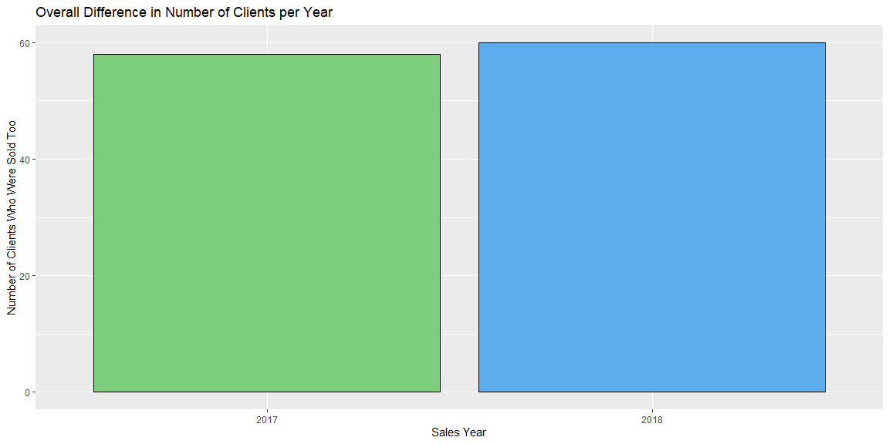
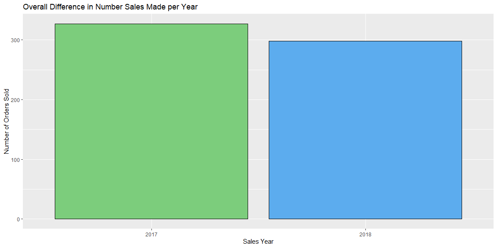
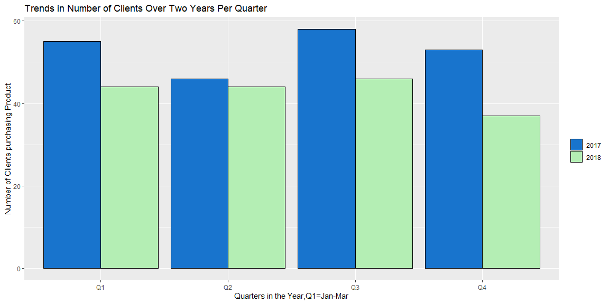
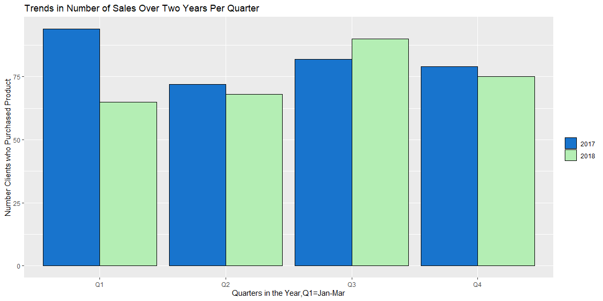
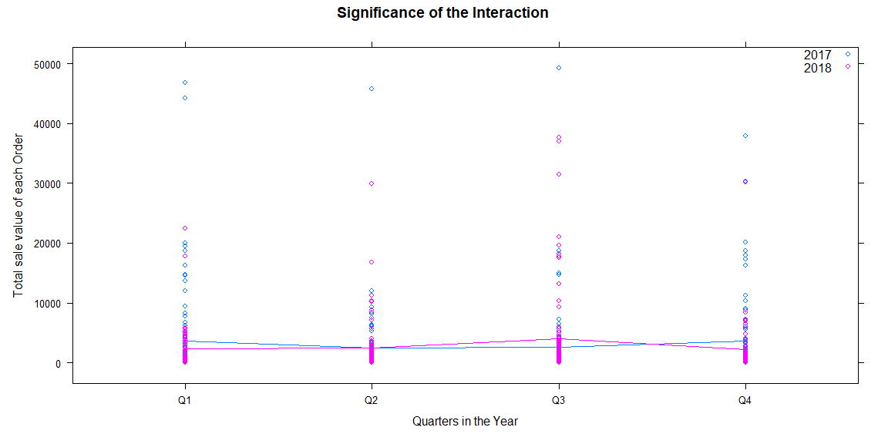

```r
library(tidyverse)
library(DT)
library(pander)
library(readr)
library(mosaic)
library(car)
library(ggplot2)
library(wesanderson)

SalesData <- read_csv("2SalesData2017-2018.csv")

SalesData <- SalesData %>%
  mutate(Date2 = as.POSIXct( strptime(Date,format = "%m/%d/%Y")), 
         month = months(Date2),
         weekday = weekdays(Date2),
         quarter = quarters(Date2),
         not_year = julian(Date2),
         year = ifelse(not_year<17530,2017,2018),
         amount2 = parse_number(Amount))
         
options(dplyr.summarise.inform = FALSE)
```


```r
SalesData2 <- SalesData %>%
  filter(!is.na(Date))

SalesData3 <- SalesData2 %>%
  group_by(year,Name) %>%
  summarise(n())

SalesData4 <- SalesData3 %>%
  group_by(year) %>%
  summarise(Clients=n())

SalesData5 <- SalesData2 %>%
  group_by(month,year) %>%
  summarise(monthsum = sum(amount2))

SalesData6 <- SalesData5 %>%
  group_by(year)%>%
  summarise(yearsum=sum(monthsum))

SalesData7<-SalesData2%>%
  group_by(quarter,year)%>%
  summarise(quartersum=sum(amount2))

SalesData8<-SalesData2%>%
  group_by(month,quarter,year)%>%
  summarise(monthsum=sum(amount2),sample=n())

SalesData9<-SalesData2%>%
  group_by(year,quarter,month,Name)%>%
  summarise(n())

SalesData10<-SalesData9%>%
  filter(year==2018)

SalesData11<-SalesData9%>%
  filter(year==2017)

SalesData13<-SalesData2%>%
  group_by(year,quarter,month,Name,PONumber)%>%
  summarise(ordersum=sum(amount2))

SalesData14<-SalesData13%>%
  group_by(year)%>%
  summarise(Orders=n())

SalesData15<-SalesData13%>%
  group_by(year,quarter)%>%
  summarise(Orders=n())

SalesData12<-SalesData9%>%
  group_by(year,quarter)%>%
  summarise(Clients=n())
```


## Your Outcomes {.tabset .tabset-fade .tabset-pills}

I started by organizing your data to gain a better understanding of what happened over the past two years of sales. understanding that for part of 2018 you were not working full time but had other coworkers helping with your sales area.

### Year Totals

The first graph describes the number Clients sold to each year.

```r
ggplot(SalesData3,aes(x=factor(year)))+
  geom_bar(fill=c("palegreen3","steelblue2"),color="black")+
  labs(x="Sales Year",y="Number of Clients Who Were Sold Too",title="Overall Difference in Number of Clients per Year")
```

<!-- -->

```r
pander(SalesData4)
```


----------------
 year   Clients 
------ ---------
 2017     58    

 2018     60    
----------------
The second graph describes the number of individual sales each year.


```r
ggplot(SalesData13,aes(x=factor(year)))+
  geom_bar(fill=c("palegreen3","steelblue2"),color="black")+
  labs(x="Sales Year",y="Number of Orders Sold", title="Overall Difference in Number Sales Made per Year")
```

<!-- -->

```r
pander(SalesData14)
```


---------------
 year   Orders 
------ --------
 2017    327   

 2018    298   
---------------

### Quarter Comparisons

The first graph describes the number of clients sold to in each quarter in both years.

```r
ggplot(SalesData9,aes(x=factor(quarter),fill=factor(year)))+
  geom_bar(position="dodge",color="black")+
 labs(x="Quarters in the Year,Q1=Jan-Mar",y="Number of Clients purchasing Product",title="Trends in Number of Clients Over Two Years Per Quarter")+
  scale_fill_manual("legend", values = c("2017" = "dodgerblue3", "2018" = "darkseagreen2"))+
  theme(legend.title = element_blank())
```

<!-- -->

```r
pander(SalesData12)
```


--------------------------
 year   quarter   Clients 
------ --------- ---------
 2017     Q1        55    

 2017     Q2        46    

 2017     Q3        58    

 2017     Q4        53    

 2018     Q1        44    

 2018     Q2        44    

 2018     Q3        46    

 2018     Q4        37    
--------------------------


The second graph compares the number of orders placed in each quarter in both years. 

```r
ggplot(SalesData13,aes(x=factor(quarter),fill=factor(year)))+
  geom_bar(position="dodge",color="black")+
  labs(x="Quarters in the Year,Q1=Jan-Mar",y="Number Clients who Purchased Product",title="Trends in Number of Sales Over Two Years Per Quarter")+
  scale_fill_manual("legend", values = c("2017" = "dodgerblue3", "2018" = "darkseagreen2"))+
  theme(legend.title = element_blank())
```

<!-- -->

```r
pander(SalesData15)
```


-------------------------
 year   quarter   Orders 
------ --------- --------
 2017     Q1        94   

 2017     Q2        72   

 2017     Q3        82   

 2017     Q4        79   

 2018     Q1        65   

 2018     Q2        68   

 2018     Q3        90   

 2018     Q4        75   
-------------------------


##

### Interpretation of Outcomes

From the Data provided above and the graphical summaries there are some assumptions that can be made. For instance, there was a 29 sale drop from 2017 to 2018. this could indicate many different things such as difference in sale strategy or others but is probably somewhat related to the medical issues you had during 2018.

What was most interesting to me was the number of sales increases from quarter 2 to quarter 3 for 2018 while it steadily climbs though all of 2017.


## Data Analysis


### Info of Test
Out of the sales data you provided to me from 2018 and 2017 I decided to compare the averages of the P.O.# total sale prices. In the individual quarters for each year and to check and see if there was a significant decrease or increase from year to year in average sale price.

Provided a base line $\alpha=.1$ ($\alpha$ meaning alpha) to test whether there is a significant difference in the averages of the sales values in each quarter between the years. This will help determine if something done during the separate years is providing a change in the average.

### Numerical Summary of Test

This is a numerical summary of the ANOVA test I preformed to determeine if there was a significant difference between the averages of each quarters sales from year to year.


```r
pander(summary(salesaov))
```


------------------------------------------------------------------
      &nbsp;        Df     Sum Sq     Mean Sq    F value   Pr(>F) 
------------------ ----- ----------- ---------- --------- --------
   **quarter**       3    55073307    18357769   0.4794    0.6968 

     **year**        1    11615127    11615127   0.3033    0.582  

 **quarter:year**    3    226136624   75378875    1.968    0.1175 

  **Residuals**     617   2.363e+10   38296451     NA        NA   
------------------------------------------------------------------

Table: Analysis of Variance Model

```r
xyplot(ordersum ~ as.factor(quarter), data=SalesData13, groups=year, type=c("p","a"), main="Significance of the Interaction",xlab="Quarters in the Year",ylab="Total sale value of each Order", auto.key=list(corner=c(1,1)))
```

<!-- -->

### Meaning of Results

From the results of the ANOVA test preformed there is no reason to believe there is a difference in the average of quarterly sales between the years. This would indicate that the methods of sales has in no way effected the average sales price each quarter. while the Significance of Interaction graph does indicate a small difference in the averages it is not substantial enough to lead to any changes that would need to be sought out. 


I would suggest looking into more of your history with the sales. Doing this could provide some greater insight into sales practices that could lead to a increase overall of sales and greater income for the business. Form the data you provided me with I couldn't find any significant trends but was close to finding some trends.


