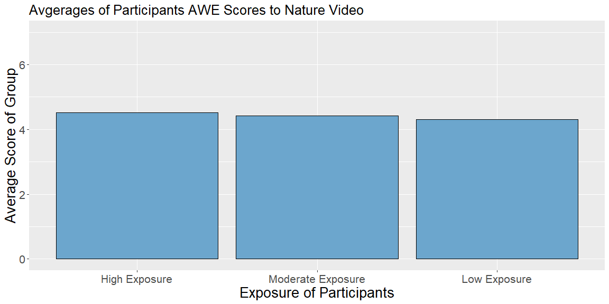
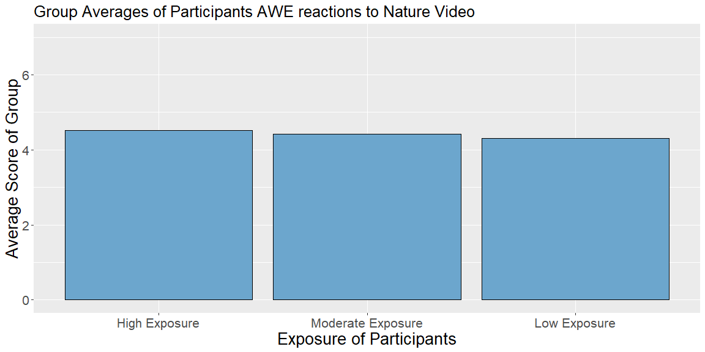
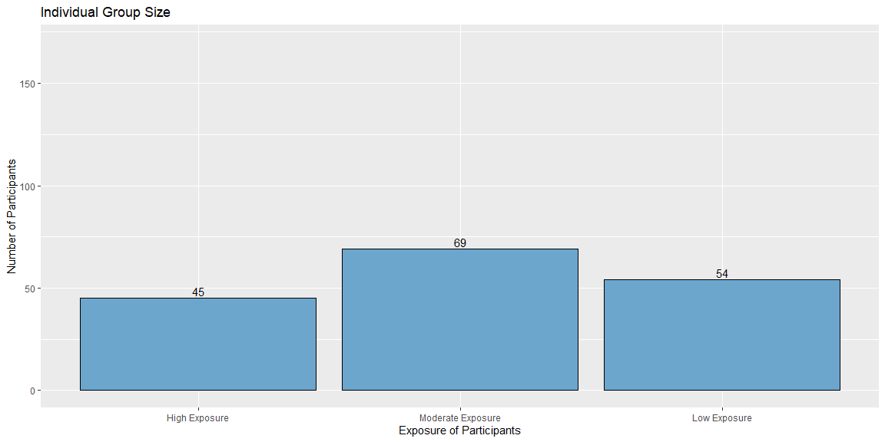
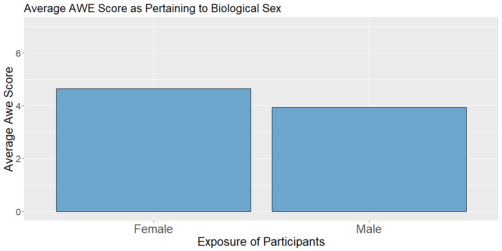
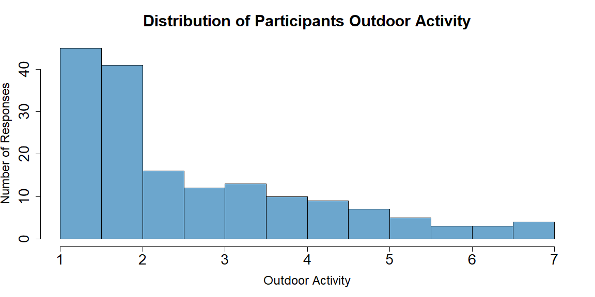

```r
pander(myaov)
```


-----------------------------------------------------------------------
         &nbsp;           Df    Sum Sq   Mean Sq   F value    Pr(>F)   
------------------------ ----- -------- --------- --------- -----------
 **as.factor(VIDCODE)**    2    370.2     185.1     97.64    4.134e-29 

     **Residuals**        173   327.9     1.896      NA         NA     
-----------------------------------------------------------------------

Table: Analysis of Variance Model


```r
data2<-projdata%>%
group_by(groupings_quart)%>%
summarise(grpAVG=mean(AWES_avg))%>%
mutate(groupings_names=case_when(
  groupings_quart %in% c(1) ~ "High Exposure",
  groupings_quart %in% c(2) ~ "Moderate Exposure",
  groupings_quart %in% c(3) ~ "Low Exposure"))%>%
  mutate(groupings_names=fct_reorder(groupings_names,groupings_quart))


data3<-projdata%>%
  group_by(groupings_quart)%>%
  summarise(participants=n())%>%
  mutate(groupings_names=case_when(
  groupings_quart %in% c(1) ~ "High Exposure",
  groupings_quart %in% c(2) ~ "Moderate Exposure",
  groupings_quart %in% c(3) ~ "Low Exposure"))%>%
  mutate(groupings_names=fct_reorder(groupings_names,groupings_quart))


data4<-projdata%>%
  group_by(SEX)%>%
  summarise(grpAVG=mean(AWES_avg))%>%
  filter(SEX=="Male"|SEX=="Female")
```


```r
ggplot(data2,aes(x=groupings_names,y=grpAVG))+
  geom_col(fill="skyblue3",color="black")+
  labs(x="Exposure of Participants",
       y="Average Score of Group",
       title="Avgerages of Participants AWE Scores to Nature Video")+
  ylim(0,7)+
  theme(text = element_text(size=16),
        axis.text.x = element_text( size = 16),
        axis.text.y = element_text(size = 16),  
        axis.title.x = element_text( size = 20),
        axis.title.y = element_text(size = 20))
```

<!-- -->


```r
ggplot(data2,aes(x=groupings_names,y=grpAVG))+
  geom_col(fill="skyblue3",color="black")+
  labs(x="Exposure of Participants",
       y="Average Score of Group",
       title="Group Averages of Participants AWE reactions to Nature Video")+
  ylim(0,7)+
  theme(text = element_text(size=16),
        axis.text.x = element_text( size = 16),
        axis.text.y = element_text(size = 16),  
        axis.title.x = element_text( size = 20),
        axis.title.y = element_text(size = 20))
```

<!-- -->


```r
ggplot(data3,aes(x=factor(groupings_names),y=participants))+
  geom_col(fill="skyblue3",color="black")+
  labs(x="Exposure of Participants",
       y="Number of Participants",
       title="Individual Group Size")+
  geom_text(aes(label=participants,vjust=-.25))+
  ylim(0,170)
```

<!-- -->


```r
ggplot(data4,aes(x=SEX,y=grpAVG))+
  geom_col(fill="skyblue3",color="black")+
  labs(x="Exposure of Participants",
       y="Average Awe Score",
       title="Average AWE Score as Pertaining to Biological Sex")+
  ylim(0,7)+
  theme(text = element_text(size=16),
        axis.text.x = element_text( size = 20),
        axis.text.y = element_text(size = 16),  
        axis.title.x = element_text( size = 20),
        axis.title.y = element_text(size = 20))
```

<!-- -->


```r
hist(projdata$outdoor_avg,col="skyblue3",xlab="Outdoor Activity",ylab="Number of Responses",main="Distribution of Participants Outdoor Activity",cex.lab=1.5, cex.axis=1.75, cex.main=1.95, cex.sub=1.75)
```

<!-- -->


