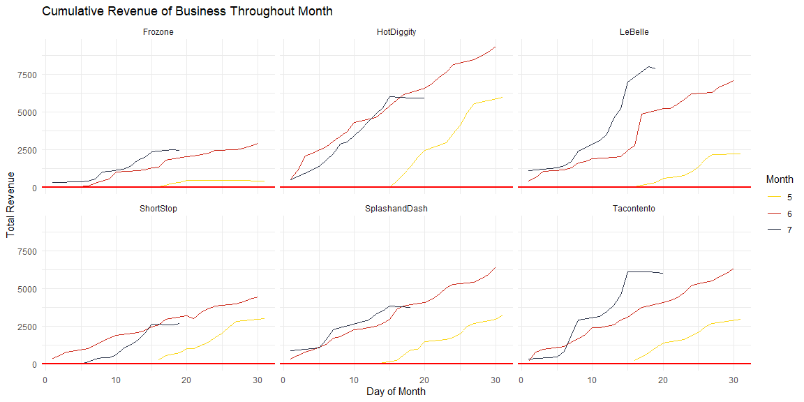
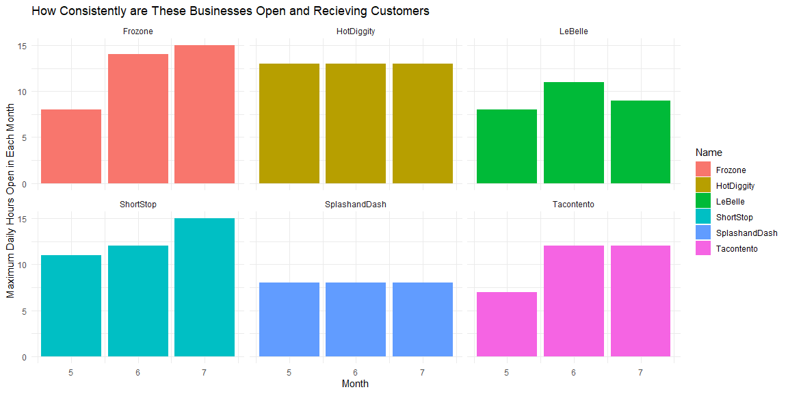
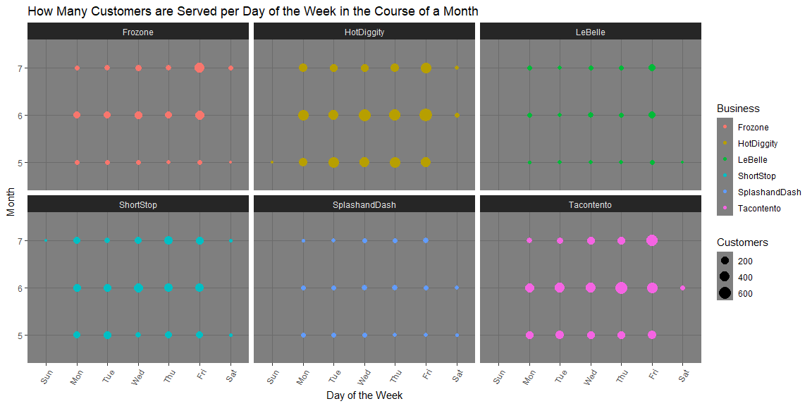

```r
url_csv <- "https://byuistats.github.io/M335/data/sales.csv"
salesdata <- read_csv(url_csv)
```

## Background

We have transaction data for a few businesses that have been in operation for three months. Each of these companies has come to your investment company for a loan to expand their business. Your boss has asked you to go through the transactions for each business and provide daily, weekly, and monthly gross revenue summaries and comparisons. Your boss would like a short write up with tables and visualizations that help with the decision of which company did the best over the three month period. You will also need to provide a short paragraph with your recommendation after building your analysis.

## Data Wrangling


```r
salesdata_wrang <- salesdata %>% 
  mutate(
        Time = with_tz(Time, tzone = "America/Denver"),
        Month = month(Time),
        Day = mday(Time),
        Wday = wday(Time, label = TRUE),
        Hour = hour(Time)
  ) %>% 
  filter(Name != "Missing", Month != 4)

sales_daily <- salesdata_wrang %>%
  group_by(Name, Month, Day) %>% 
  summarise(total = sum(Amount)) %>% 
  mutate(Cumsum = cumsum(total))

sales_total <- salesdata_wrang %>%
  group_by(Name) %>% 
  summarise(total = sum(Amount))

sales_hours <- salesdata_wrang %>% 
  group_by(Name, Day, Month) %>% 
  summarise(open = max(Hour)-min(Hour)) %>% 
  group_by(Name, Month) %>% 
  summarise(Longest_Day = max(open))

sales_numbers <- salesdata_wrang 
```

## Data Visualization

### Question 1

Provide visualizations that show gross revenue over time for each company (Choose if you want to aggregate at the daily, the weekly, or the monthly level).


```r
ggplot(sales_daily)+
  geom_line(aes(x = Day, y = Cumsum, color = as.character(Month)))+
  facet_wrap(vars(Name))+
  scale_color_manual(values = wes_palette("BottleRocket2"))+
  geom_hline( yintercept = 0, size = 1, color = "Red1")+
  theme_minimal()+
  labs(title = "Cumulative Revenue of Business Throughout Month",
       x = "Day of Month", 
       y = "Total Revenue", 
       color = "Month")
```

<!-- -->

```r
pander(sales_total)
```


-----------------------
     Name        total 
--------------- -------
    Frozone      5741  

  HotDiggity     21207 

    LeBelle      17089 

   ShortStop     10101 

 SplashandDash   13428 

  Tacontento     15264 
-----------------------

### Question 2

Provide a visualization that gives insight into hours of operation for each company.


```r
ggplot(sales_hours)+
  geom_col(aes(x = Month, y = Longest_Day, fill = Name))+
  facet_wrap(vars(Name))+
  theme_minimal()+
  labs(title = "How Consistently are These Businesses Open and Recieving Customers",
       x = "Month", 
       y = "Maximum Daily Hours Open in Each Month", 
       color = "Business")
```

<!-- -->

### Question 3

We don’t have employee numbers, but customer traffic (number of transactions) may be helpful. Provide a visualization on customer traffic for each company.


```r
ggplot(sales_numbers)+
  geom_count(aes(x = Wday, y = as.character(Month),color = Name))+
  facet_wrap(~Name)+
  theme_dark()+
  theme(axis.text.x = element_text(angle = 60, hjust = 1))+
  labs(title = "How Many Customers are Served per Day of the Week in the Course of a Month",
       x = "Day of the Week", 
       y = "Month", 
       color = "Business",
       size = "Customers")
```

<!-- -->

## Conclusions

Altogether there is a clear winner in all of the three charts. HotDiggity provides the most compeling case for consistent customer attraction and hours open along with having a stellar revenue which I find very important for long term investment. So my suggestion is to invest in HotDiggity.
