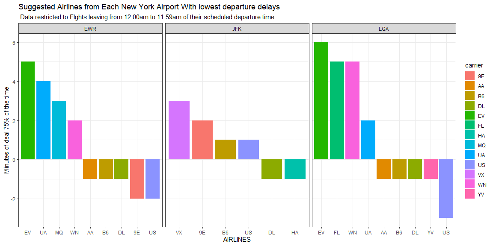
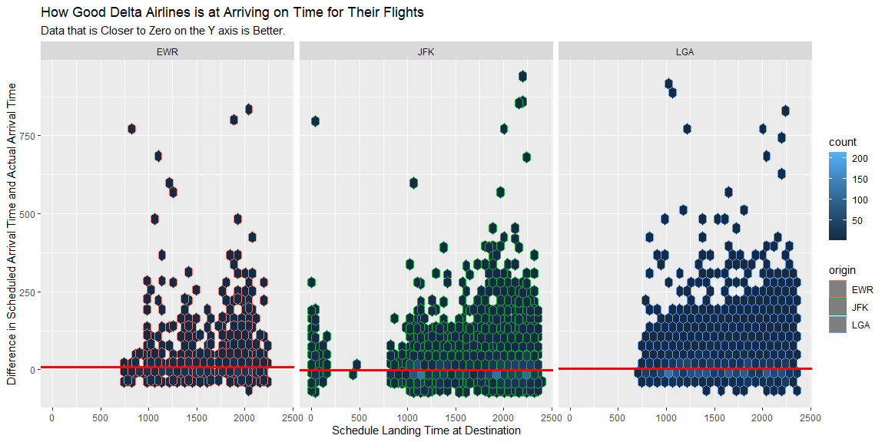
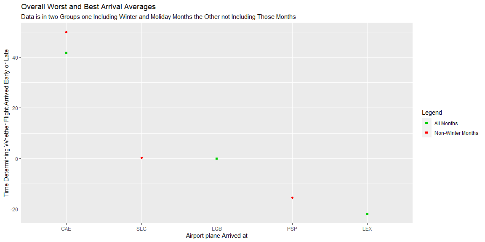

```r
working_flights <- flights
```

## Background

You just started your internship at a big firm in New York, and your manager gave you an extensive file of flights that departed JFK, LGA, or EWR in 2013. From this data (which you can obtain in R) your manager wants you to answer the following questions:

1. If I am leaving before noon, which two airlines do you recommend at each airport (JFK, LGA, EWR) that will have the lowest delay time at the 75th percentile?

2. Which origin airport is best to minimize my chances of a late arrival when I am using Delta Airlines?

3. Which destination airport is the worst airport for arrival time? You decide on the metric for “worst.”

## Data Wrangling


```r
working_flights_1 <- working_flights %>% 
  na.omit() %>% 
  filter(sched_dep_time <= 1159) %>% 
  filter(carrier != "OO") %>% 
  group_by(carrier, origin) %>%
  mutate(avg_dep_carrier = mean(dep_delay))%>% 
  summarise(q3 = quantile(dep_delay, 0.75)) %>% 
  filter(q3 != 0) %>%
  arrange(desc(q3))

flights_1_2 <- slice_max(working_flights_1, q3, n = 5)
  

working_flights_2 <- working_flights


working_flights_3 <- working_flights

reorder_within <- function(x, by, within, fun = mean, sep = "___", ...) {
  new_x <- paste(x, within, sep = sep)
  stats::reorder(new_x, by, FUN = fun)
}


scale_x_reordered <- function(..., sep = "___") {
  reg <- paste0(sep, ".+$")
  ggplot2::scale_x_discrete(labels = function(x) gsub(reg, "", x), ...)
}
```

## Question 1
1. If I am leaving before noon, which two airlines do you recommend at each airport (JFK, LGA, EWR) that will have the lowest delay time at the 75th percentile?


```r
ggplot(flights_1_2)+
  geom_col(aes(x = reorder_within(carrier, -q3, origin), y = q3,fill = carrier))+
  scale_x_reordered()+
  facet_wrap(~origin, scales = "free_x")+
  labs(x = "AIRLINES", y = "Minutes of deal 75% of the time", title = "Suggested Airlines from Each New York Airport With lowest departure delays", subtitle = " Data restricted to Flghts leaving from 12:00am to 11:59am of their scheduled departure time")+
  theme_bw()
```

<!-- -->
Overall there is not a great difference from the various airlines at this degree of tolerance by looking at the 75 precentile of the flights. there is a clear answer though as Delta(DL) and Us airlines(US) are consistently in the bottom three and will most often leave prior to their departure time I would suggest these two airlines.


## Question 2
2. Which origin airport is best to minimize my chances of a late arrival when I am using Delta Airlines?


```r
flight_2_1 <- working_flights


flight_2_3 <- flight_2_1 %>% 
  filter(carrier == "DL") %>% 
  select("arr_delay", "origin", "carrier") %>% 
  group_by(origin) %>% 
  summarise(Avg_Arrival_Delay = mean(arr_delay,na.rm =TRUE)) 

flight_2_2 <- flight_2_1 %>% 
  filter(carrier == "DL")
```


```r
ggplot(data = flight_2_2)+
  geom_hex( mapping = aes(x = sched_arr_time, y = arr_delay, color = origin, group = month))+
  geom_hline(data = flight_2_3, aes(yintercept = Avg_Arrival_Delay  ),color = "Red", size = 1.25)+
  facet_wrap(~origin)+
  #scale_y_continuous(trans = "log10")
  labs(x = "Schedule Landing Time at Destination", y = "Difference in Scheduled Arrival Time and Actual Arrival Time", title = "How Good Delta Airlines is at Arriving on Time for Their Flights", subtitle = "Data that is Closer to Zero on the Y axis is Better.")
```

<!-- -->

```r
pander(flight_2_3)
```


----------------------------
 origin   Avg_Arrival_Delay 
-------- -------------------
  EWR           8.78        

  JFK          -2.379       

  LGA           3.928       
----------------------------

JFK Airport has the best average of the three origin airports for flights as sent by delta. As the flights tend to arrive at their destination airport on average 2:22 minutes faster (converted the decimal to minutes for convience). In general there is little difference between the arrival times for the airports.

## Question 3

3. Which destination airport is the worst airport for arrival time? You decide on the metric for “worst.”


```r
flight_3_1 <- working_flights

'%notin%' <- Negate('%in%')

flight_3_1 <- working_flights %>% 
  filter(carrier != "OO") %>% 
  select(carrier,dest,air_time,arr_time,arr_delay,sched_arr_time,month) %>% 
  group_by(dest) %>%
  summarise(mean_arr = mean(arr_delay,na.rm = TRUE)) %>% 
  arrange(mean_arr)

flight_3_2 <- working_flights %>% 
  filter(carrier != "OO") %>%
  filter(month %notin% c(1,12,2,11)) %>% 
  select(carrier,dest,air_time,arr_time,arr_delay,sched_arr_time,month) %>% 
  group_by(dest) %>% 
  summarise(mean_arr = mean(arr_delay,na.rm = TRUE)) %>% 
  arrange(mean_arr)

flight_3_1_1 <- flight_3_1 %>%
  filter(dest %in% c("LGB", "LEX", "CAE")) %>% 
  arrange(desc(mean_arr))

flight_3_2_1 <- flight_3_2 %>%
  filter(dest %in% c("SLC", "PSP", "CAE")) %>% 
  arrange(desc(mean_arr))
```


```r
colors <- c("All Months" = "green3", "Non-Winter Months" = "red")

ggplot(mapping = aes(x = dest,y = mean_arr))+
  geom_point(data = flight_3_1_1, aes(color =  "All Months"), size = 1.5, shape = 15)+
  geom_point(data = flight_3_2_1, aes(color = "Non-Winter Months"), size = 1.5,shape = 16)+
  scale_x_discrete(limits=c("CAE","SLC","LGB","PSP","LEX"))+
  labs(x = "Airport plane Arrived at", 
       y = "Time Determining Whether Flight Arrived Early or Late", 
       title = "Overall Worst and Best Arrival Averages", 
       subtitle = "Data is in two Groups one Including Winter and Moliday Months the Other not Including Those Months", 
       color = "Legend")+
  scale_color_manual(values = colors)
```

<!-- -->

```r
pander(flight_3_1_1)
```


-----------------
 dest   mean_arr 
------ ----------
 CAE     41.76   

 LGB    -0.06203 

 LEX      -22    
-----------------

```r
pander(flight_3_2_1)
```


-----------------
 dest   mean_arr 
------ ----------
 CAE     49.94   

 SLC     0.2397  

 PSP     -15.44  
-----------------

This was an interesting question to answer. I asked myself would I rather be early or late and then I could only think that this was an interesting question. So I determined to answer all of them at once. as you wil see CAE Airport(Columbia Metropolitan) is by far the worst of the the 2 groups although PSP(Palm Springs) and LEX(Blue Grass) were really good at arriving early but that could also be bad in certain situations. So I wanted to show who were the most cosistent for arriving ontime. While it wasn't SLC(Salt Lake City)  both times they came close for the Non-Winter months data portion but LGB(Long Beach) was by far the best for Non-Winter months. So to answer oyur question CAE airport is the worst for arriving ontime in the worst way of being late by over 40 minutes on average.


