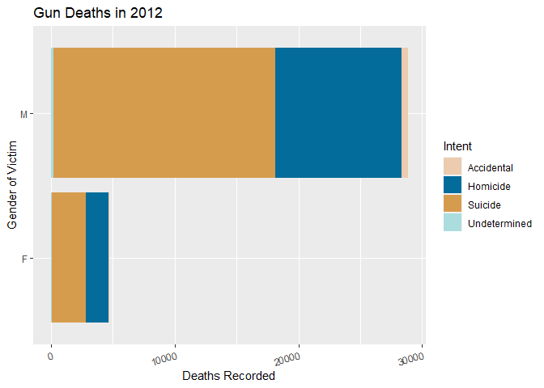
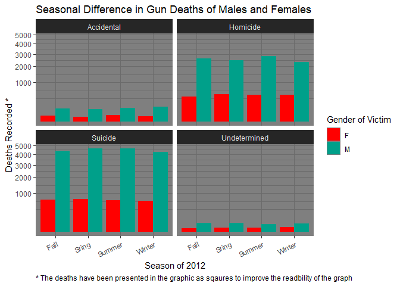
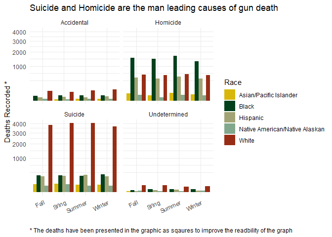

```r
gun_data <- read_csv("full_data.csv")
```

## Background

  This data is a representation of gun deaths in the USA from 2012 to 2014. I took the data and looked for trends along the seasons in 2012 to determine if there was anything significant to help aid in relieving the amount of gun deaths each year. As there is nearly 33,000. I found that the focus should be on educating males specifically to help decrease the amount of gun homicide deaths specifically among the black community.


```r
gun_data_1 <- gun_data %>% 
  mutate(
          Season = case_when(
            as.numeric(month) %in% c(12,1,2) ~ "Winter",
            as.numeric(month) %in% c(3,4,5) ~ "Sring",
            as.numeric(month) %in% c(6,7,8) ~ "Summer",
            as.numeric(month) %in% c(9,10,11) ~ "Fall"
          ) 
        ) %>% 
  filter(!is.na(intent))
gun_data_2 <- gun_data_1 %>% 
  group_by(intent) %>%
  summarise(cnt = n()) 

gun_data_intent <- gun_data_1 %>% 
  filter(year == 2012)
```

## Task 1
Create a chart


```r
ggplot()+
  geom_bar(gun_data_intent, mapping = aes(y= sex, fill = intent))+
  theme(axis.text.x = element_text(angle = 15, hjust = 1))+
  labs(title = "Gun Deaths in 2012", x = "Deaths Recorded", y = "Gender of Victim", fill = "Intent")+
  scale_fill_manual(values = wes_palette("Darjeeling2"))
```

<!-- -->


## Task 2 & 3 & 4 & 5


```r
gun_data_2 <- gun_data %>% 
  mutate(
        Season = case_when(
            as.numeric(month) %in% c(12,1,2) ~ "Winter",
            as.numeric(month) %in% c(3,4,5) ~ "Sring",
            as.numeric(month) %in% c(6,7,8) ~ "Summer",
            as.numeric(month) %in% c(9,10,11) ~ "Fall"
          )
        ) %>% 
  filter(year == 2012) %>% 
  group_by(Season, sex, intent) %>% 
  summarise(cnt = n())

gun_data_3 <- gun_data %>% 
  mutate(
        Season = case_when(
            as.numeric(month) %in% c(12,1,2) ~ "Winter",
            as.numeric(month) %in% c(3,4,5) ~ "Sring",
            as.numeric(month) %in% c(6,7,8) ~ "Summer",
            as.numeric(month) %in% c(9,10,11) ~ "Fall"
          )
        ) %>% 
  filter(year == 2012) %>% 
  filter(sex == "M") %>% 
  group_by(Season, race,  intent) %>% 
  summarise(cnt = n())


gun_data_4 <- gun_data %>% 
  mutate(
        Season = case_when(
            as.numeric(month) %in% c(12,1,2) ~ "Winter",
            as.numeric(month) %in% c(3,4,5) ~ "Sring",
            as.numeric(month) %in% c(6,7,8) ~ "Summer",
            as.numeric(month) %in% c(9,10,11) ~ "Fall"
          )
        ) %>% 
  filter(year == 2012) %>% 
  filter(Season == "Summer") %>% 
  filter(sex == "M") %>% 
  group_by(race,  intent, education) %>% 
  summarise(cnt = n())
```

### Graph One 

  This graph shows the differences in male and female deaths over each season in the year 2012. As the bars show there is a large difference between males who have died by a gun and females. This indicates that we should focus on males as they have higher gun deaths.

```r
ggplot(gun_data_2,aes(x = Season, y=cnt, fill = sex))+
  geom_col(position = "dodge")+
  facet_wrap(~intent)+
  theme_dark()+
  theme(axis.text.x = element_text(angle = 25, hjust = 1), plot.caption = element_text(hjust = 0))+
  scale_y_continuous(trans = "sqrt")+
  labs(title = "Seasonal Difference in Gun Deaths of Males and Females",
       caption = "* The deaths have been presented in the graphic as sqaures to improve the readbility of the graph",
       x = "Season of 2012", 
       y = "Deaths Recorded *", 
       fill = "Gender of Victim")+
  scale_fill_manual(values = wes_palette("Darjeeling1"))
```

<!-- -->

### Graph Two

  This Graph depicts the differences in gun deaths along race in the various seasons. From the data I determined that the summer is the worst season for gun deaths and that will be the main source of data in my next graphic. As we see suicide is the main leading cause of gun deaths especially among Whites. Where as for homicides Blacks are killed more often than any other race. This leads to the question whether to focus on to the question which group to focus on those who have been killed by homicide or suicide. My suggestion would be homicide as there were less blacks overall recorded in the dataset. This is a problem as they are the most susceptible to homicide gun deaths.


```r
ggplot(gun_data_3,aes(x = Season, y=cnt, fill = race))+
  geom_col(position =  "dodge")+
  facet_wrap(~intent)+
  theme_minimal()+
  theme(axis.text.x = element_text(angle = 25, hjust = 1), plot.caption = element_text(hjust = 0))+
  scale_y_continuous(trans = "sqrt")+
  labs(title = "Suicide and Homicide are the man leading causes of gun death",
       caption = "* The deaths have been presented in the graphic as sqaures to improve the readbility of the graph",
       x = "", 
       y = "Deaths Recorded *", 
       fill = "Race")+
  scale_fill_manual(values = wes_palette("Cavalcanti1"))
```

<!-- -->

### Graph Three

  After seeing the discrepency between the number homicide deaths of blacks and the number of recorded enteries of blacks in the entire data set. I decided to take a look at what effect education might have on gun deaths in relation to race in the summer season alone. When looking at the homicide section of the plot we find that as males obtain more education they tend to be killed by gun homicide less. This is very important as it also seems to drop the precentages into more evenly distributed sections pertaining to the amount of people of each race in the dataset.


```r
ggplot(gun_data_4,aes(x = education, y=cnt, fill = race))+
  geom_col()+
  facet_wrap(~intent)+
  theme_gray()+
  theme(axis.text.x = element_text(angle = 25, hjust = 1), plot.caption = element_text(hjust = 0), plot.title = element_text(hjust = .125))+
  scale_y_continuous(trans = "sqrt")+
  labs(title = "How Education Affects the Amount of People Killed by Guns in the Summer Months",
       caption = "* The deaths have presented in the graphic as sqaures to improve the readbility of the graph",
       x = "Intent for Gun Death", 
       y = "Deaths Recorded *", 
       fill = "Race")+
  scale_fill_manual(values = wes_palette("Cavalcanti1"))
```

<!-- -->


