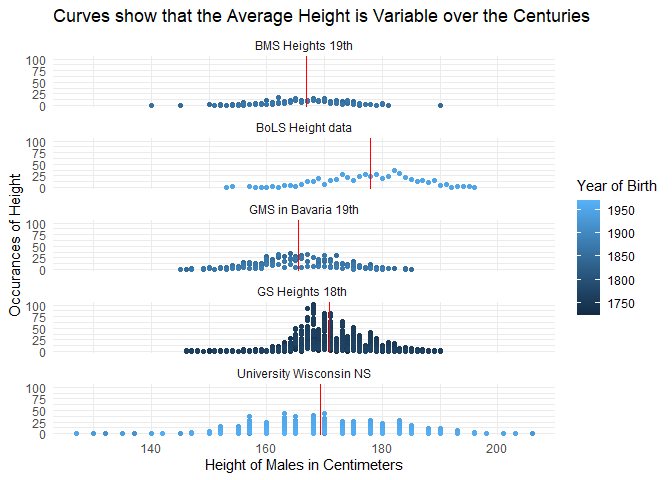

```r
url_1dta <- "https://byuistats.github.io/M335/data/heights/germanconscr.dta"
url_2dta <- "https://byuistats.github.io/M335/data/heights/germanprison.dta"
url_3zip <- "https://byuistats.github.io/M335/data/heights/Heights_south-east.zip"
url_4csv <- "https://raw.githubusercontent.com/hadley/r4ds/main/data/heights.csv"
url_5sav <- "http://www.ssc.wisc.edu/nsfh/wave3/NSFH3%20Apr%202005%20release/main05022005.sav"

download(url_3zip, destfile = "dbf_file.zip", mode = "wb")
url_3zip <- unzip("dbf_file.zip")


german_19th <- read_dta(url_1dta)
bavarian_19th <- read_dta(url_2dta)
german_18th <- read.dbf(url_3zip)
BOLS_20th <- read_csv(url_4csv)
UoW <- rio::import(url_5sav)
```

## Background

The Scientific American argues that humans have been getting taller over the years. As data scientists in training, we would like to use data to validate this hypothesis. This case study will use many different datasets, each with male heights from different years and countries. Our challenge is to combine the datasets and visualize heights across the centuries.

This project is not as severe as the two quotes below, but it will give you a taste of pulling various data and file formats together into “tidy” data for visualization and analysis.

## Task 1 & 2 & 3

After loading in all the data I had to wrangle it into manageable columns which was much of the same code for each data set. Making sure to grab the correct rows in some of the sets such as the 18th century German set was not easy as there werre several columns available to which are attached to a year in some way so trying to find birth year among them was slightly challenging. Google translate helped a bit but was not perfect at setting me on the right track but I ended up figuring it out.

The wrangling was not all that hard though not much needed to be done to each of the data sets except the University of Wisconsins as missing values needed to be taken out and some occurrences on the height in inches were incorrectly recorded so I took out those few occurrences. so overall the majority of the work was changing the column names and converting the height into centimeters form inches and vis-versa and then copying the code over to the next data set and finally combining all of them into one whole data set.


```r
german_19th_1 <- german_19th %>% 
  select(birth_year = bdec,height.cm = height) %>% 
  mutate(
        height.in = height.cm/2.54,
        study = "GMS in Bavaria 19th"
        )
  
bavarian_19th_1 <- bavarian_19th %>% 
  select(birth_year = bdec ,height.cm = height) %>% 
  mutate(
        height.in = height.cm/2.54,
        study = "BMS Heights 19th"
        )

german_18th_1 <- german_18th %>% 
  select(birth_year = GEBJ, height.cm = CMETER, height.in = ZOLLVRD) %>% 
  mutate(
        study = "GS Heights 18th "
        )
BOLS_20th_1 <- BOLS_20th %>% 
  filter(sex == "male") %>% 
  select(height.in = height) %>% 
  mutate(
        birth_year = 1950,
        height.cm = height.in*2.54,
        study = "BoLS Height data"
        )
UoW_1 <- UoW %>% 
  select(birth_year = DOBY, height.in = RT216I, height.ft = RT216F) %>% 
  filter(birth_year != -2, height.in != -1,,height.ft != -2,height.in <=11) %>% 
  mutate(
        birth_year = birth_year + 1900,
        height.in = height.in + (height.ft*12),
        height.cm = height.in*2.54,
        study = "University Wisconsin NS"
        ) %>% 
  select(!height.ft)

combined_data <- bind_rows(UoW_1, BOLS_20th_1, german_18th_1, bavarian_19th_1, german_19th_1)

View(combined_data)

average_height <- combined_data %>% 
  mutate(height.cmRD = round(height.cm)) %>% 
  group_by(study) %>% 
  summarise(height_avg = mean(height.cm))

combined_data1 <- combined_data %>% 
  mutate(height.cmRD = round(height.cm)) %>% 
  group_by(birth_year,height.cmRD,study) %>% 
  summarise(height_cnt = n())
```

## Task 4

By study the charts produced we can vy easily see there is not a large difference between heights over the centuries. In fact in the 18th century people on average were taller according to the data I used. This is something to be wary of as the sample size for the 18th century males is much larger than the other centuries. While my graphs show that the hypothesis is incorrect that we are growing taller as a species over the centuries I would suggest that more data is needed to be collected to determine if that is true or not. As for now my graphs show that we are not taller than people in the 18th century and thus we are not growing as a species. I came to this conclusion through looking at the bell curves of the different studies in each century and taking the average of each study. (The BOLS study did have a higher average but a much smaller sample size so I factored the study less important)


```r
ggplot(combined_data,aes(x = birth_year, y = height.cm, color = study))+
  geom_point()+
  facet_wrap(vars(study),scales = "free_x",)+
  theme_dark()+
  theme(axis.text.x = element_text(angle = 90))+
  labs(title = "Aggregate Data showing Heights from 18th to 20th century",
       x = "Year of Birth", 
       y = "Height of Males in Centimeters", 
       color = "Sourced Study")
```

<!-- -->

```r
ggplot(combined_data1)+
  geom_point(aes(x = height.cmRD,y = height_cnt, color = birth_year))+
  geom_vline(data = average_height,aes(xintercept = height_avg ),color = "red")+
  facet_col(facets = vars(study), space = "free")+
  theme_minimal()+
  labs(title = "Curves show that the Average Height is Variable over the Centuries",
       x = "Height of Males in Centimeters", 
       y = "Occurances of Height", 
       color = "Year of Birth")
```

<!-- -->

## Conclusions
